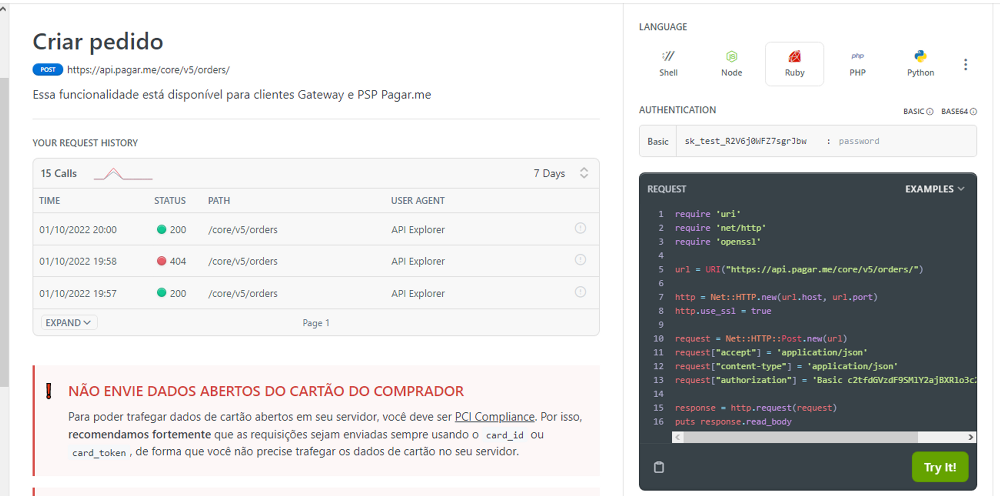

##  

[Erros e Rate Limit](https://docs.pagar.me/reference/erros-1)

Para ajudar no processo de debug (que pode ser bastante extensivo e apoiado em tentativa e erro), segue uma listagem do código de status das **principais exceções (não todas - checar documentação oficial)** que podem ser lançadas pelo [Pagar.me](http://Pagar.me) - retirados da documentação. A documentação de erros do Mozilla, enquanto não específica para o caso do Pagar.me, pode dar uma visão mais ampla sobre o erro e auxiliar na compreensão do problema. E claro, você ainda pode saber o que deu de tão errado em projetos da Struct para você não gastar o mesmo tempo debugando - que maravilha!

Outro recurso poderosíssimo é o API Explorer do Pagar.me (imagem abaixo), que permite realizar requisições diretamente da página web deles. Insira os parâmetros para a requisição em questão e clique em Try it! para realizar o teste. O histórico de requisições do API Explorer pode ser visto na listagem da imagem.

Assim, em um cenário de debug, insira os parâmetros que está tentando enviar no API Explorer e, depois, reproduza os testes em código. Pode salvar muito tempo!

| Descrição do Erro - Pagar.me | Mozilla | Struct |
| --- | --- | --- |
| ‘Invalid request’ - Requisição Inválida | 400 Bad Request |  |
| ‘Invalid API key’ - Chave de API inválida |  401 Unauthorized | Comumente falha na definição das variáveis de ambiente que carregam as chaves (principalmente em produção). |
| ‘An informed resource was not found’ - O recurso solicitado não existe | 404 Not Found |  |
| ‘Business validation error’ - Parâmetros válidos mas a requisição falhou | 412 Precondition Failed | Comumente a estruturação do request JSON está errada. Coloque os parâmetros na ordem proposta pela documentação. Muitas vezes é tentativa e erro. Cuidado com posição de parâmetros/objetos opcionais, como split e code. |
| ‘Contract validation error’  - Parâmetros inválidos | 422 Unprocessable Entity | Comumente é parâmetro inválido: CPFs, CEPs, Email, Telefone, Endereço, etc. Verifique os valores aceitos para cada parâmetro na documentação. Cuidado especial com CPF. Para testes, use um gerador de CPF. |
| ‘Internal server error’ - Ocorreu um erro interno | 500 Internal Server Error |  |
