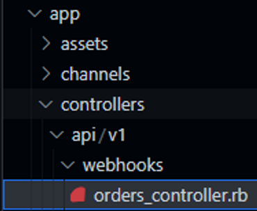
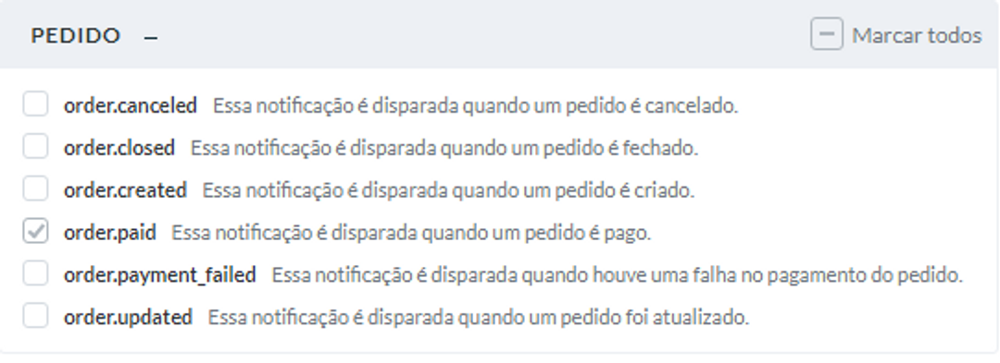

No âmbito da integração com o Pagar.me, webhooks são ferramentas poderosíssimas para tornar os passos de uma jornada de pagamentos mais coesos e melhorar a experiência tanto do cliente quanto do vendedor. Podemos pensar em webhooks como notificações enviadas pelo [Pagar.me](http://Pagar.me) para outro servidor (no caso, a API Rails), personalizáveis e configuráveis de acordo com nossos interesses.

Como exemplo, iremos configurar um webhook que será disparado para nossa API Rails no momento em que uma Order do [Pagar.me](http://Pagar.me) é atualizada para o status *paid.* Mas primeiro, precisamos pensar como exatamente vamos receber essas notificações na nossa API.

Os webhooks podem ser relevantes para diversas controllers e, como precisamos fornecer uma rota de post da nossa API para o Pagar.me, vamos criar um submódulo dedicado para webhooks e criar uma controller correspondente a cada tipo de entidade que sofre um evento. Para o nosso caso, criaremos a Orders Controller, já que é a única entidade que queremos observar por enquanto.



Dentro da Orders Controller, podemos capturar essas informações e definir rotinas a serem executadas logo após o recebimento do hook. Neste caso, definimos um método para tratar especificamente o estado *paid*. Agora, no *routes.rb*, defina as rotas correspondentes (como POST). Segue exemplo:

```ruby
namespace 'webhooks' do
   scope 'order/' do
        post 'paid', to: 'orders#paid'
   end
end
```

No código exemplo abaixo, realizaremos algumas tarefas assim que recebermos o post do Pagar.me:

- Captação do order_id e subsequente identificação do pedido correspondente
- Atualização de campo de primeiro pagamento do pedido
- Identificação do cliente relacionado ao pedido e disparo de email de confirmação de pagamento

```ruby
class Api::V1::Webhooks::OrdersController < ApplicationController

  def paid
		# Capturando o objeto data dos params recebidos
    data = params[:data]
		# Acessando o objeto data e definindo o order_id
    order_id = data[:id]
		# Achando o pedido correspondente ao order_id
		pedido = Pedido.find_by(order_code: order_id)

		# Atualizando o campo de primeiro pagamento do pedido
    pedido = Pedido.find_by(order_code: order_id)
		if pedido.first_payment == nil
	    pedido.first_payment = data[:charges][0][:paid_at].to_date
	    pedido.save!
		end
	
		# Mandando um email de confirmação de pagamento para o cliente
    client = Client.find(pedido.client_id)

    mail = PaymentConfirmationMailer.payment_confirmation_mailer(client.email)
    mail.deliver_now!

    render json: { message: 'Request received' }, status: :ok
  end
end
```

Note que podemos realizar diversas rotinas diferentes em decorrência de um mesmo webhook. Utilize todo o potencial dos webhooks para deixar os usuários e administradores a par das principais etapas na jornada de pagamento e torne suas experiências ricas!

O último passo é realizar a configuração do webhook e a definição da rota. Na Dashboard do Pagar.me, vá para a seção Configurações → Webhooks e clique em Criar Webhook. Para definir a URL, basta pegar o endereço do servidor com base nas rotas que definimos anteriormente. No nosso exemplo, a URL em questão poderia ser a seguinte: 

https://exemplo-api.herokuapp.com/api/v1/webhooks/order/paid

Depois, selecione os eventos correspondentes que farão parte do webhook. Lembre que, conforme a necessidade, é recomendável que se configurem múltiplos webhooks diferentes para lidar com eventos diferentes.



E pronto! Teste o funcionamento do webhook exaustivamente utilizando o ambiente de testes e os métodos supracitados.

#