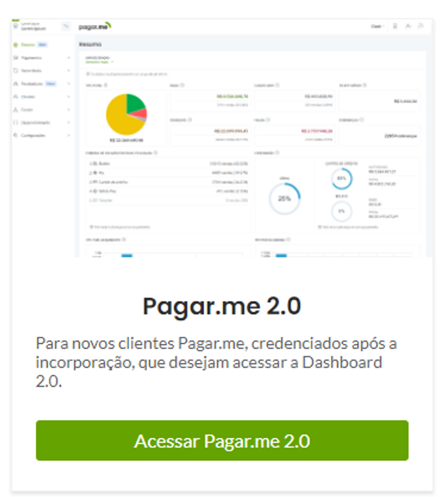
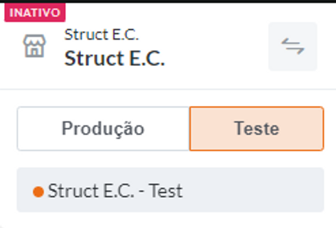

## Autenticação

Primeiramente, vamos achar nossas chaves de autenticação. Ao entrar no [Pagar.me](http://Pagar.me), escolhemos acessar a Dashboard 2.0.



O [Pagar.me](http://Pagar.me) conta com dois tipos de chave distintos: a de teste, e a de produção.

Com a chave de testes, estaremos em um ambiente de Sandbox para testar todas as funcionalidades livremente - além de ter acesso a simuladores de pagamento (mais sobre aqui [https://docs.pagar.me/docs/simulador-de-boleto](https://docs.pagar.me/docs/simulador-de-boleto) ). A chave de produção deverá ser utilizada no sistema real.

Durante o desenvolvimento do sistema, é ideal que seja utilizada a chave de testes na conta da Struct. Conforme as funcionalidades de pagamento são finalizadas, podemos mudar para a chave de testes na conta do Cliente. para continuar os testes. Caso dê tudo certo ao final, mudamos para a chave de produção da conta do Cliente. 

Assim, é importante que se tenha o acesso à conta do Cliente com antecedência, também levando em conta que o processo de criação e análise de uma conta no [Pagar.me](http://Pagar.me) pode levar vários dias.

Para realizar a autenticação com a API, definiremos no começo do nosso arquivo proxy.rb:

```ruby
module Payment
  class Proxy

	client = PagarmeCoreApi::PagarmeCoreApiClient.new(
	  basic_auth_user_name: basic_auth_user_name,
	  basic_auth_password: basic_auth_password
	)

	end
end
```

Você deve utilizar a chave da seguinte maneira (seja de teste ou produção):

- Username: ****Chave Secreta
- Password: *****string vazia*

As chaves podem ser encontradas na seção Desenvolvimento da dashboard. No canto superior esquerdo, clique no ícone com duas setas (mostrado abaixo) para selecionar o ambiente da dashboard - isso determinará qual chave será exibida na seção Desenvolvimento.

- Chave Secreta de Testes: sk_test_*
- Chave Secreta de Produção: sk_*


