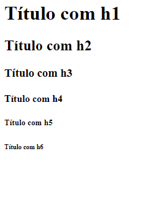
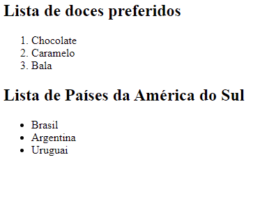

# HTML
## Sobre o HTML
O HTML(HyperText Markup Language) é uma linguagem de marcação de hipertexto que é a base para a construção de sites na web. 
Ela geralmente é acompanhada pelo CSS e JavaScript, que juntos são renderizados para formar as páginas da web.
### Formato geral:
```HTML
<!DOCTYPE html>
<html>
    <head>

    </head>
    <body>

    </body>
</html>
```


    Obs: A primeira linha (\<!DOCTYPE html>) serve para identificar para o navegador a versão do HTML que está sendo utilizada. No caso, a versão "html" representa o HTML5.


## Tags
São elementos dentro do HTML que desempenham um certo papel visual, semântico ou separatório. Existem 2 tipos de tags: 
* As que precisam de uma para abrir e outra para fechar. Por exemplo: \<body>\</body>
* As que "se fecham sozinhas". Exemplo: \

## Funções de algumas tags
Existem muitas tags com diferentes funções no HTML, e como não é possível mostrar todas nesse tutorial, algumas das mais importantes serão abordadas agora.

### Body
Essa tag está presente em todo arquivo HTML, pois representa onde todos os itens presentes na página ficarão para serem mostrados no site.
#### Exemplo de uso:
```HTML
<body>
    <!--
        Onde ficarão todas as outras tags que aparecerão no site
    -->
</body>
```


    Obs: `<!-- -->` é um comentário em HTML


### Head
Essa tag é uma das únicas que ficam fora da tag \<body>, pois é onde ficam elementos que não ficam explícitos na página em si, como \<meta> e \<title> 
#### Exemplo de uso:
```HTML
<head>
    <meta charset="utf-8">
    <title>Título</title>
</head>
```
### Title
Essa tag fica dentro da tag \<head> e representa o título visto na aba do navegador. O nome exibido do título fica entre as tags.
#### Exemplo de uso:
```HTML
<head>
    <meta charset="utf-8">
    <title>Titulo do site</title>
</head>
```
##### Nesse caso, "Titulo do site" apareceria na aba do navegador:


### H1 até H6
Essa é uma sequência de tags de título que entram no \<body>, que vai do \<h1>, o maior dos títulos, passando por \<h2>, \<h3>, \<h4> e \<h5>, intermediários, até o \<h6>, que é o menor.
#### Exemplo de uso:
```HTML
<body>
    <h1>Título com h1</h1>
    <h2>Título com h2</h2>
    <h3>Título com h3</h3>
    <h4>Título com h4</h4>
    <h5>Título com h5</h5>
    <h6>Título com h6</h6>
</body>
```


### Div
Essa tag é meramente separatória, serve para separar blocos sem ter a semântica de outras tags, como a section. Pode ser útil para facilitar a divisão e estilo de conjuntos de elementos.

#### Exemplo de uso:
```HTML
<body>
    <div>
        <!--
            Outros elementos
        -->
    </div>
</body>
```

### Section
Essa tag é semântica, serve para separar blocos de conteúdos relacionados. Por exemplo, poderia ter um título (alguma tag h1,h2...), um parágrafo e uma imagem relacionada ao texto.

#### Exemplo de uso:
```HTML
<body>
    <h1>Título da página inteira</h1>
    <section>
        <h2>Titulo da seção 1</h2>
        
        <p>Texto relacionado à seção 1</p>
    </section>
    <section>
        <h2>Titulo da seção 2</h2>
        
        <p>Texto relacionado à seção 2</p>
    </section>
</body>
```
### Nav
Essa tag é onde a navegação do site fica, geralmente tem links(tag \<a>) para outras partes do site.

#### Exemplo de uso:
```HTML
<body>
    <nav>
        <a href="/pagina_1.html">Página 1</a>
        <a href="/pagina_2.html">Página 2</a>
    </nav>
</body>
```

### P
Essa tag representa um parágrafo de texto, onde o texto fica dentro das tags \<p>

#### Exemplo de uso:
```HTML
<body>
    <p>
        Texto em um parágrafo.
    </p>
</body>
```
### Img
Essa tag representa uma imagem. Para que o navegador saiba de onde encontrar o conteudo da imagem, é necessário o atributo "src" para indicar o caminho.
#### Exemplo de uso:
```HTML
<body>
    
</body>
```


    OBS: \ é uma tag que se fecha sozinha, como mostrada no exemplo.


### A
Essa tag é o link para outra página da web, outra página do próprio site ou outra parte do site. Para que o navegador saiba para onde o link vai, o atributo "href" é utilizado. Por padrão, o link é exibido com uma cor azul e tem uma decoração tipica de links no texto.

#### Exemplo de uso:
```HTML
<body>
    <a href="www.facebook.com">Facebook</a>
    <a href="/pages/pagina2.html">Página 2</a>
    <a href="#session2">Seção 2</a>
    <section id="session2">
        <h2>Titulo da seção 2</h2>
        
        <p>Texto relacionado à seção 2</p>
    </section>
</body>
```
### Listas
Aqui vamos falar de 2 tipos de listas no HTML: as listas ordenadas(\<ol>) e as listas não ordenadas(\<ul>). Ambas representam formas de listar elementos \<li>(list items), mas as \<ol> tem números em alguma ordem(por padrão é crescente) e as \<ul> tem apenas um símbolo para listar(por padrão é o "·")

#### Exemplo de uso:
```HTML
<body>
    <h2>Lista de doces preferidos</h2>
    <ol>
        <li>Chocolate</li>
        <li>Caramelo</li>
        <li>Bala</li>
    </ol>
    <h2>Lista de Países da América do Sul</h2>
    <ul>
        <li>Brasil</li>
        <li>Argentina</li>
        <li>Uruguai</li>
    </ul>
</body>
```


## Atributos
Os atributos são utilizados dentro da "tag de abertura", no caso de uma tag que precisa de uma tag para abrir e outra para fechar, ou dentro da única tag, no caso de uma tag que "se fecha sozinha". A sintaxe para colocar os atributos geralmente é: nomedoatributo="valor", onde valor depende do que se quer colocar para o atributo. 

### Exemplo:
```HTML
<body>
    <!-- Exemplo de tag que precisa de uma para abrir e outra para fechar -->
    <a href="link.com"></a> <!-- Atributo dentro da tag de abertura: href -->
    <!-- Exemplo de tag que se fecha sozinha --> 
     <!-- Atributo dentro da tag: src -->
</body>
```

Nos exemplos passados, utilizamos os atributos como src e href, mas agora vamos aprender os principais atributos de algumas tags:

### Atributos Gerais

#### Id
É um atributo de valor único que serve para identificar o elemento que o possui. Pode ser utilizado depois para se referenciar a esse elemento.

#### Class
É um atributo como o id, mas é utilizado o mesmo valor para diferentes elementos para agrupá-los em uma classe, para estilizarmos todos de uma vez (vamos ver isso mais tarde no css).

```HTML
<div id="div1" class="meus-elementos"></div>
<div id="div2" class="meus-elementos"></div>
<div id="div3" class="meus-elementos"></div>
<a class="meus-elementos"></a>
```


    Obs: eles não são obrigatórios.


### Atributos de \

#### Src
É de onde vem a imagem; pode vir dentro do próprio conjunto de pastas ou ainda de um endereço na web.
#### Alt
É uma descrição da imagem, serve para quando a imagem não foi carregada ou para quando se usa um leitor de página. Não é obrigatório, porém é altamente recomendado por questões de acessibilidade.

##### Exemplo de Uso:
```HTML
 <!-- Imagem nas pastas -->
 <!-- Imagem na web -->
```

### Atributos de \<a>

#### Href
É para onde o link irá levar. Pode ser um site externo, um arquivo ou página dentro do site ou um elemento por meio de um id.

#### Target
Qual será o "alvo" do link. Pode ser "_self" para o link abrir na mesma página ou "_blank" para o link abrir em uma nova guia. Não é obrigatório.

##### Exemplo de Uso:
```HTML
<a href="/pages/pagina1.html" target="_self">Minha página 1</a> <!-- Link para uma página dentro do site -->
<a href="https://pt-br.facebook.com/" target="_blank">Facebook em outra página</a> <!-- Link para um site externo -->
<a href="#session2">Seção 2</a> <!-- Link para um elemento -->
<section id="session2">
    <h2>Titulo da seção 2</h2>
    
    <p>Texto relacionado à seção 2</p>
</section>
```