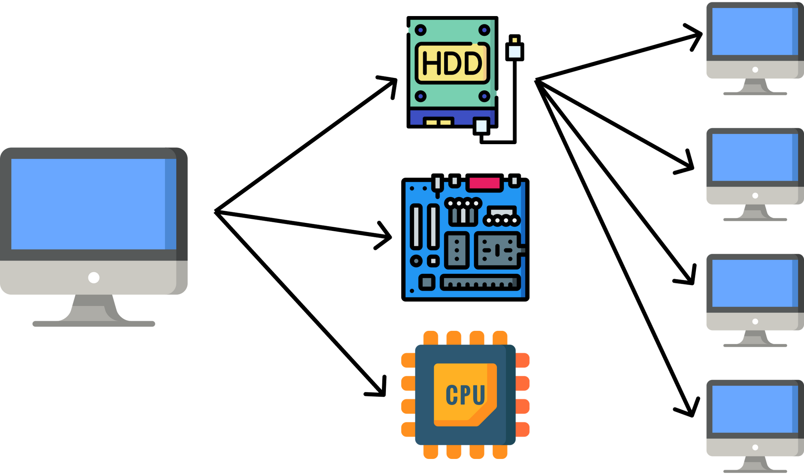

# Componentes

A componentização é um processo de modularização do web site/app, e está presente em tudo feito com React. Pode ser feita uma analogia com um computador:



Um computador pode ser dividido, de maneira simplificada, em memória, processador e placa-mãe. Agora imagine se tivéssemos que projetar novamente um processador toda vez que formos produzir um computador novo, o trabalho seria infinitamente mais difícil. Ao invés disso podemos criar apenas uma vez cada peça e apenas replicar ele em qualquer computador.

O mesmo pode ser aplicado ao nosso código de React, ao criar um componente na tela, podemos facilmente utilizar ele em outro trecho de código de maneira simplificada. Imagine replicar o código da navbar em toda página que possuir uma navbar.

## Criando um componente

O React permite que sejam criados componentes a partir de classes, funções e arrow functions. A última maneira é a mais recomendada.
Um componente pode receber argumentos em sua chamada e deve retornar um único elemento JSX (HTML escrito em javascript):

```js
// src/components/ComponentName/index.js
const ComponentName = (props) => {
	// props são as propriedades recebidas pelo componente
	return <div>Olá, {props.batata}</div>
};

export default ComponentName;


// src/pages/PageName/index.js
import ComponentName from "../../components/ComponentName"

const PageName = () => {
	return(
        <section>
            <h1>Página</h1>
            <ComponentName batata="um nome qualquer"/>
        </section>
    )
};

export default ComponentName;
```

A página criada renderizará um HTML semelhante a:

```html
<section>
	<h1>Página</h1>
	<div>Olá, um nome qualquer</div>
	<!-- a propriedade "batata" recebeu o valor "um nome qualquer", utilizado na renderização do componente -->
</section>
```

Observações:

- Pode ser utilizado javascript dentro de um componente, inclusive dentro do JSX ("HTML") se usado `{}` ao redor.
- Caso deseje-se retornar duas tags irmãs como componente, o React fornece uma tag fantasma, que não será considerada ao construir o HTML:

```js
const ComponentName = ({ id, batata }) => {
	return (
		<>
			<label htmlFor={id}>{batata}</label>
			<button id={id}>Clique em mim</button>
		</>
	);
};

export default ComponentName;
```

Aprenda mais com a [documentação oficial](https://reactjs.org/tutorial/tutorial.html).
Também existe uma [documentação mais recente](https://beta.reactjs.org/learn), que ainda está no beta mas tem didática melhor.
