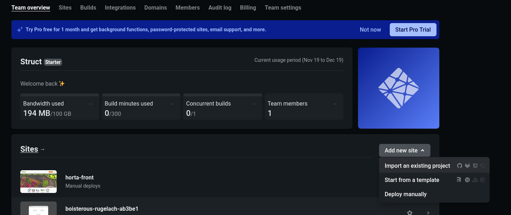

# Deploy no Netlify

## O que é o [Netlify](https://www.netlify.com/)

O Netlify é um serviço de hospedagem de sites estáticos, que também oferece serviços de _staging_ e _deploy_ automatizados. Isso significa que não é possível hospedar backend no Netlify, apenas frontend (com possibilidade de _AWS Lambda_).

Para fazer _deploy_ no Netlify, a possiblidade atualmente gratuita é fazer _deploy_ manual, que consiste em gerar e colocar manualmente os arquivos que serão servidos no site. Sendo assim, o processo de _bundling_ deve ser feito na mão.

## Como fazer _deploy_ manual

### Preparando o projeto

Na própria main, mude o `/public/favicon.ico` para o real ícone do projeto. Mude o `index.html`, trocando os conteúdos das tags `<meta>`, `<title>` e a `lang` da tag `<html>`. Pense na possibilidade de adicionar um `/public/robots.txt`.


Para seguir os próximos passos, primeiro crie uma branch chamada `netlify` no seu projeto, caso ainda não exista.

Mude todas as referências a localhost por suas respectivas urls de produção. Por exemplo, se você tem uma instância axios com a url `http://localhost:3333/api/v1`, mude para `https://seu-projeto.railway.app/api/v1` ou equivalente (a url de _staging_). Se a url das imagens é `http://localhost:3333/`, mude para `https://seu-projeto.railway.app` ou equivalente.


#### Para roteamento client side

Geralmente fazemos _deploy_ de React como [_single page app_](https://en.wikipedia.org/wiki/Single-page_application), com um roteador _client side_, como react-router-dom. Sendo assim, rotas não são [_endpoints_](https://www.cloudflare.com/pt-br/learning/security/api/what-is-api-endpoint/), e sempre devem ser retornados os mesmos arquivos pra requisições, independente da rota. 

Para tal, adicione o arquivo `_redirects` no do projeto com o seguinte conteúdo:
```
/*    /index.html   200

```

### Fazendo _deploy_ manual

1. Vá para a branch `netlify`
2. Rode o comando `yarn build` para gerar uma pasta `build` com os arquivos estáticos.
3. Faça login na conta de projetos da struct
4. Selecione a opção de _deploy_ manual (__deploy_ manually_)

5. Arraste e solte os arquivos da pasta `build` na área de upload