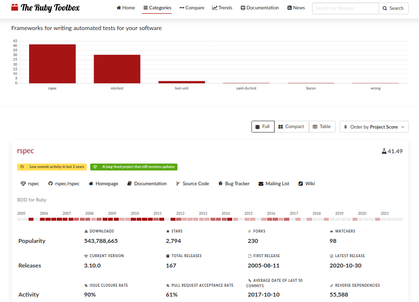

## O que é testar?

Basicamente, não testamos uma aplicação sempre que estamos usando ela? Sim, no entanto, esses testes são demorados e, às vezes, temos que entregar algo de prontidão para um cliente. Nesse sentido, mesmo que verifiquemos a aplicação, podemos deixar alguns erros bem específicos passar sem que percebamos.

Por mais que testes a mão sejam importantes e válidos, não é sempre o ideal e acaba tomando muito do nosso tempo, então, nossa solução é automatizar nossos testes, pois isso acelera nosso fluxo de desenvolvimento, nos ajuda a identificar todos os tipos de erros e também faz com que possamos escrever códigos mais eficientes.

Ok, mas como esses testes são feitos? Basicamente, nós escrevemos um teste para um certo caso e esperamos que o resultado bata com o esperado. No caso do rails, com o rspec, podemos verificar nossos testes no terminal facilmente:

Nesse caso, percebemos que temos 17 exemplos de teste e 0 falhas. Caso tenha algo errado, como saberemos?

Nesse caso, temos um teste que está errado e a nossa ferramenta de teste além de nos alertar que tem algo errado, ainda nos mostra, exatamente, onde está e o que está inexato, assim, facilitando que possamos corrigir nossos problemas no código.

## Por que testar?

Agora que sabemos o que é um teste, vem uma pergunta: 'Por que devemos testar?'

Principalmente, porque evita que fiquemos horas e horas testando tudo manualmente. Além disso, também é mais fácil, quando escrevemos testes, encontrar certos problemas e pensar em alguns cenários que não tínhamos pensado antes de começarmos a escrever os testes.

É claro que podemos escrever testes ruins ou esquecer certos cenários que devem ser adicionados na nossa aplicação, mas, durante o tempo que desenvolvemos uma aplicação, é possível que nós mesmos percebamos que certos testes devem ser modificados e/ou adicionados ou alguém da nossa equipe de desenvolvimento pode nos avisar.

Quando escrevemos testes, somos forçados a pensar nos problemas que nossa aplicação pode ter e, nesse sentido, precisaremos de testes mais abrangentes e melhores escritos para garantir que nada vá falhar.

Por fim, como resultados de testes teremos códigos mais bem escritos, menos trabalho, código mais eficiente e com menos problemas. Acho que é algo que vale a pena.

## Por que Rspec?

Como podemos ver, segundo o site [The Ruby Toolbox](https://www.ruby-toolbox.com/), o rspec é a ferramenta de teste mais utilizada em rails atualmente, nesse sentido, para quem desenvolve em rails é de extrema importância que essa ferramenta seja dominada, pois é com ela que estaremos tendo mais contato no seu cotidiano como programador e/ou como desenvolvedor de alguma empresa que trabalha com rails.

Além do mais, o Rspec facilita a integração com outras gems como a [factory bot rails](https://github.com/thoughtbot/factory_bot_rails), por exemplo, então, é uma gem muito abrangente e útil para termos nas nossas aplicações.

Outrossim, é bem mais fácil usarmos o Rspec pois temos uma documentação muito extensa, uma comunidade bem ativa, livros e uma série de tutoriais que podem nos ajudar caso encontremos algum problema.

Além de todos os benefícios já citados, a gem Rspec não é só muito poderosa para escrever testes, mas também facilita muito para entendermos os testes, ou seja, teremos uma extrema facilidade para escrevermos testes e, caso alguém precise modificar, é bem fácil de entender os casos de testes também.

Assim sendo, nossa escolha pelo Rspec Rails não se dá apenas pela sua facilidade, elegância, capacidade de integração com outras ferramentas, mas também pelo seu uso no mercado, atualmente. Todos esses fatores, fazem com que o uso da gem Rspec seja de extrema importância para todos os desenvolvedores rails que desejam aprender rails a fundo.