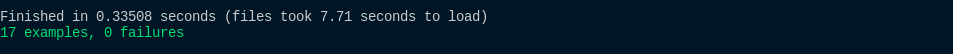
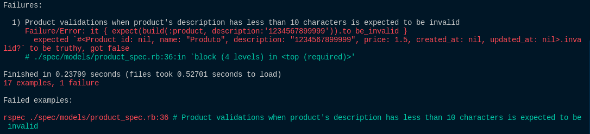

## O que é testar?

Basicamente, não testamos uma aplicação sempre que estamos usando ela? Sim, no entanto, esses testes são demorados e, às vezes, temos que entregar algo de prontidão para um cliente, nesse sentido, mesmo que verifiquemos a aplicação, podemos deixar alguns erros bem específicos passar sem que percebamos.

Nesse sentido, por mais que esse tipo de teste seja válido, não é o ideal e acaba tomando muito do nosso tempo, então, nossa solução é automatizar nossos testes, pois isso acelera nosso fluxo de desenvolvimento, nos ajuda a identificar todos os tipos de erros e também faz com que possamos escrever códigos mais eficientes.

Ok, mas como esses testes são feitos? basicamente, nós escrevemos um teste para um certo caso e esperamos que o resultado bata com o esperado. No caso do rails, com o rspec, podemos verificar nossos testes no terminal facilmente:

Nesse caso, percebemos que temos 17 exemplos de teste e 0 falhas. Caso tenha algo errado, como saberemos?

Nesse caso, temos um teste que está errado e a nossa ferramenta de teste além de nos alertar que tem algo errado, ainda nos mostra, exatamente, onde está e o que está inexato, assim, facilitando que possamos corrigir nossos problemas no código.

## Por que testar?

Agora que sabemos o que é um teste, vem uma pergunta: 'Por que devemos testar?'

Principalmente, porque evita que fiquemos horas e horas testando tudo manualmente. No entanto, além disso, também é mais fácil, quando escrevemos testes, encontrar certos problemas e pensar em alguns cenários que não tínhamos pensado antes de começarmos a escrever os testes.

É claro que podemos escrever testes ruins ou esquecer certos cenários que devem ser adicionados na nossa aplicação, mas, durante o tempo que desenvolvemos uma aplicação, é possível que nós mesmos percebamos que certos testes devem ser modificados e/ou adicionados ou alguém da nossa equipe de desenvolvimento pode nos avisar.

Além disso, quando escrevemos testes, somos forçados a pensar nos problemas que nossa aplicação pode ter e, nesse sentido, precisaremos de testes mais abrangentes e melhores escritos para garantir que nada vá falhar.

Por fim, como resultados de testes teremos códigos mais bem escritos, menos trabalho, código mais eficiente e com menos problemas. Acho que é algo que vale a pena.