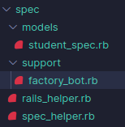

# Instalando o Factory Bot

Quando analisamos o código no nosso [teste de models](testando-models.md), é percebível que criamos diversas variáveis chamadas 'estudante' para fazermos os testes, todavia, temos uma forma mais ortodoxa de fazer esse processo.

Usando a gem [factory_bot_rails](https://rubygems.org/gems/factory_bot_rails), nós podemos criar fábricas para testes, mas antes de entendermos melhor o funcionamento dessa gem, vamos aprender a instalar ela e a configurar com o Rspec.

Primeiramente, é importante ir no site Ruby Gems e, mais uma vez, copiar o nome para conseguirmos instalar no nosso arquivo Gemfile:

```ruby
group :development, :test do
  # Call 'byebug' anywhere in the code to stop execution and get a debugger console
  gem 'byebug', platforms: [:mri, :mingw, :x64_mingw]
  gem 'rspec-rails', '~> 5.0', '>= 5.0.1'
  gem 'factory_bot_rails', '~> 6.2'
end
```

Após isso, rodamos o bundle install para instalar a gem e suas dependências.

Com o factory bot instalado, nosso primeiro passo é ir na pasta spec e criar, lá dentro, uma outra pasta chamada **support** e dentro desta criamos um arquivo chamado **factory_bot.rb**.



Então, dentro do factory_bot.rb, adicionaremos o seguinte código:

```ruby
RSpec.configure do |config|
    config.include FactoryBot::Syntax::Methods
end
```

Por fim, para terminarmos de configurar o factory bot com o Rspec, vamos na pasta spec e clicamos no arquivos **rails_helper.rb**. Nesse arquivo, teremos, comentada, a seguinte linha:

`# Dir[Rails.root.join('spec', 'support', '**', '*.rb')].sort.each { |f| require f }`

Só precisamos descomentar ela e o Rspec conseguirá acessar nossos arquivos de suporte.

`Dir[Rails.root.join('spec', 'support', '**', '*.rb')].sort.each { |f| require f }`

Agora, nosso factory bot está pronto para ser usado.