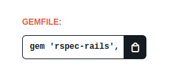

# Instalando o Rspec

Primeiramente, é necessário que criemos nossa aplicação em Rails, podemos fazer isso rodando o seguinte comando:

`rails new nome_da_aplicacao --api`

Para o nosso exemplo, criaremos uma com o seguinte nome:

`rails new aprendendo_rspec --api`

Com a aplicação criada, nós vamos até o site [Ruby Gems](https://rubygems.org/), que é um site que lista diversas gems disponíveis para o rails, e procuramos por '[rspec-rails](https://rubygems.org/gems/rspec-rails)', após isso, copiamos a linha no campo gemfile e colocamos no arquivo Gemfile dentro na nossa aplicação.



Já no Gemfile, ficará assim:

```ruby
group :development, :test do
    # Call 'byebug' anywhere in the code to stop execution and get a debugger console
    gem 'byebug', platforms: [:mri, :mingw, :x64_mingw]
    gem 'rspec-rails', '~> 5.0', '>= 5.0.1'
end
```

Vale a pena ressaltar que a parte que vem após a vírgula vai variar de acordo com a versão.

Após essa etapa, abrimos nosso terminal e rodamos dois comandos:

`bundle install`

Para, de fato, instalar a gem do rspec e depois:

`rails generate rspec:install`

Após rodar esse comando no terminal, caso tudo dê certo, será retornado o seguinte:

```bash
create  .rspec
    create  spec
    create  spec/spec_helper.rb
    create  spec/rails_helper.rb
```

Isso mostra que o comando criou a pasta **spec** e dentro dela dois arquivos foram criados o **spec_helper.rb** e o **rails_helper.rb**.