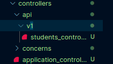
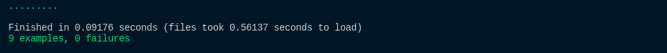

# Teste de Controller Versionada

Ok, testamos nossa controller, mas e no caso de termos uma controller versionada. O teste seria a mesma coisa? Não exatamente a mesma coisa, mas é bem parecido.

Para aprendermos como fazer testes de uma controller versionada precisamos, primeiro, versionar nossa controller atual, para isso, dentro da pasta controller criaremos uma pasta chamada de **api** e dentro desta pasta criaremos as versões, nossa versão inicial será a **v1** e, dentro da pasta **v1**, colocaremos nossa controller atual.



Caso rodemos o Rspec agora todos os testes falharão, isso porque precisamos fazer algumas modificações, a primeira modificação pontual seria na controller:

```ruby
class Api::V1::StudentsController < ApplicationController
  def index
    students = Student.all
    render json: students, status: :ok
  end

  def create
    student = Student.new(student_params)
    student.save!

    render student, status: :created
  rescue StandardError => e
    render json: { message:'Não foi possível criar um usuário' }, status: :bad_request
  end

  def show 
    student = Student.find(params[:id])
  
    render json: student, status: :ok
  rescue StandardError => e
    render json: { message:'Não foi possível encontrar o estudante' }, status: :bad_request
  end

  def update 
    student = Student.find(params[:id])
    student.update!(student_params)

    render student, status: :ok
  rescue StandardError => e  
    render json: { message:'Não foi possível editar o estudante' }, status: :bad_request
  end

  def delete
    student = Student.find(params[:id])
    student.destroy!

    render student, status: :ok
  rescue StandardError => e
    render json: { message:'Não foi possível deletar o estudante' }, status: :bad_request
  end

  private 
  
  def student_params
    params.require(:student).permit(
      'name',
      'age'
    )
  end
end
```

Assim sendo, a diferença está na primeira linha. Assim como criamos, dentro da pasta controller, a pasta api e a v1, adicionamos na class o Api::V1 precedendo o nome da controller, isso nos diz, basicamente, que é uma Api e está na versão 1.

Depois dessas mudanças precisamos mudar também o nosso arquivo de rotas:

```ruby
Rails.application.routes.draw do
  namespace 'api' do 
    namespace 'v1' do 
      scope 'students/' do 
        get 'index', to: "students#index", as: :student_index
        post 'create', to: "students#create", as: :create_student
        get 'show/:id', to: 'students#show', as: :student
        patch 'update/:id', to: 'students#update', as: :update_student
        delete 'delete/:id', to: 'students#delete', as: :delete_student
      end
    end
  end
end
```

Nesse arquivo nós, basicamente, adicionamos mais dois caminhos para a rota o **api** e o **v1** e aí, dentro desses namespaces colocamos as rotas que tínhamos definido anteriormente. Nesse sentido, tanto nossas rotas quanto nossa controller estão prontos.

Por fim, só falta arrumarmos o Rspec para começarmos a testar nossas requisições. Então, primeiramente, dentro da pasta request criamos a pasta **api** e dentro desta criamos a pasta **v1**, assim como fizemos com a controller.

```ruby
require 'rails_helper'

RSpec.describe Api::V1::StudentsController, type: :request do
    context 'GET #Index' do 
        it 'should show success status and render all students' do 
            get student_index_path
            expect(response).to have_http_status(:success)
        end
    end

    context 'POST #Create' do 
        let(:student_params) do 
            {name:"Teste", age:20}
        end

        it 'should create a student' do
            post create_student_path, params: { student: student_params }
            expect(response).to have_http_status(:created)
        end

        it 'should not create a student' do
            student_params = {name: 'oi'}
            post create_student_path, params: { student: student_params }
            expect(response).to have_http_status(:bad_request)
        end
    end

    context "GET #Show" do
        it 'with existing student' do 
             estudante = create(:student)
             get student_path(1)
             expect(response).to have_http_status(:ok)
         end

        it 'with non existing student ' do 
            get student_path(1)
            expect(response).to have_http_status(:bad_request)
        end
    end

    context "PATCH #Update" do 
        let(:estudante) { create(:student) }

        it 'should update student info' do 
            atualizado = { name: 'O aluno' }
            patch update_student_path(estudante), params: { student: atualizado }
            estudante.reload
            expect(estudante.name).to eq(atualizado[:name])
        end
    end

    context "DELETE #Delete" do 
        let(:estudante) { create(:student) }
        it 'should delete the student' do 
            delete delete_student_path(estudante), params: { id: estudante.id }
            expect(response).to have_http_status(:ok)
            expect(Student.find_by(id: estudante.id)).to be_nil
        end

        it 'with unvalid id' do
            estudante.destroy!
            delete delete_student_path(estudante), params: { id: estudante.id }
            expect(response).to have_http_status(:bad_request)
        end
    end
end
```

É importante ressaltar que os testes da model nadam mudam, todos continuam funcionais, agora para testarmos o teste unicamente dos requests precisaremos de um novo comando:

`rspec spec/requests/api/v1/students_request_spec.rb`

Nada muito complicado, é só seguir o caminho das pastas até o request que queremos, o único problema é que, ao rodarmos esse teste não vai dar certo de novo, então, vamos ter que arrumar todos nossos testes para que funcionem em uma api versionada.

## Index

Para o teste de index podemos arrumar da seguinte forma:

```ruby
context 'GET #Index' do 
        it 'should show success status and render all students' do 
            get '/api/v1/students/index'
            expect(response).to have_http_status(:success)
        end
end
```

A única mudança é na forma que chamamos a rota, porque adicionamos o /api/v1/ para acharmos o caminho correto, só com o student_index_path não conseguiremos acessar a rota da maneira certa. Por fim, ao rodarmos o teste assim, o resultado será correto.

Para verificarmos só a saída desse teste, comentei os outros testes, logo, ao rodarmos o rspec teremos como resultado:

`1 example, 0 failures`

## Create

O teste da requisição create é a mesma coisa, só precisamos mudar a rota:

```ruby
context 'POST #Create' do 
        let(:student_params) do 
            {name:"Teste", age:20}
        end

        it 'should create a student' do
            post '/api/v1/students/create', params: { student: student_params }
            expect(response).to have_http_status(:created)
        end

        it 'should not create a student' do
            student_params = {name: 'oi'}
            post '/api/v1/students/create', params: { student: student_params }
            expect(response).to have_http_status(:bad_request)
        end
end
```

Então, percebe-se que é tudo igual, a única diferença é mudar a rota.

Ao rodarmos o Rspec, teremos a seguinte saída:

`3 examples, 0 failures`

## Show

No show, o teste vai ser um pouco diferente dos anteriores, pois precisaremos passar o **id** e, agora que não podemos pegar o caminho por meio do **path**, precisamos pensar em alguma outra forma de passar o **id** na requisição.

```ruby
context "GET #Show" do
        it 'with existing student' do 
             estudante = create(:student)
             get "/api/v1/students/show/#{estudante.id}"
             expect(response).to have_http_status(:ok)
         end

        it 'with non existing student ' do 
            get "/api/v1/students/show/1"
            expect(response).to have_http_status(:bad_request)
        end
end
```

O que mudou desse método para os demais está, primeiramente, em chamarmos o id da nossa variável diretamente na rota e também no fato de precisarmos usar aspas duplas (") para conseguirmos fazer isso, pois com aspas simples (') procuraria a rota literal. No exemplo de um estudante que não existe, eu coloquei o '1' porque eu sei que não criamos nenhum estudante para esse exemplo, ou seja, ao tentarmos achar um estudante com o id de 1, nada encontraremos. Caso façamos o mesmo no primeiro exemplo e colocarmos 1 no lugar de **#{estudante.id}** também funcionaria, pois no exemplo de cima criamos um estudante, mas não é tão legal fazermos assim.

## Update

O update é bem parecido com o show, a diferença é o **params** que também usamos no Update não versionado.

```ruby
context "PATCH #Update" do 
        let(:estudante) { create(:student) }

        it 'should update student info' do 
            atualizado = { name: 'O aluno' }
            patch "/api/v1/students/update/#{estudante.id}", params: { student: atualizado }
            estudante.reload
            expect(estudante.name).to eq(atualizado[:name])
        end
end
```

Então, mais uma vez utilizamos o **#{estudante.id}**, só que passamos o **params** que queremos que seja passado para o estudante, assim como foi feito no método anterior, mais uma vez, a única mudança é na passagem da rota.

Se quisermos fazer um método para testar o caso de falha podemos fazer o seguinte:

```ruby
it 'should not update student info' do 
            atualizado = { name: 'O aluno' }
            patch "/api/v1/students/update/2", params: { student: atualizado }
            estudante.reload
            expect(response).to have_http_status(:bad_request)
end
```

Bem simples, não muda muita coisa do que já vimos.

## Delete

Por fim, o delete é a mesma coisa:

```ruby
context "DELETE #Delete" do 
        let(:estudante) { create(:student) }
        it 'should delete the student' do 
            delete "/api/v1/students/delete/#{estudante.id}", params: { id: estudante.id }
            expect(response).to have_http_status(:ok)
            expect(Student.find_by(id: estudante.id)).to be_nil
        end

        it 'with unvalid id' do
            estudante.destroy!
            delete "/api/v1/students/delete/2", params: { id: estudante.id }
            expect(response).to have_http_status(:bad_request)
        end
end
```

Ao rodarmos o comando **rspec spec/requests/api/v1/students_request_spec.rb**, o que receberemos de retorno no terminal será:



Note que, nesse caso, temos 9 exemplos funcionais porque adicionamos o teste do caso de falha do update.

Caso mude de versão, só vai ser necessário criar a pasta v2 e mudar as classes e aí continuará funcional.