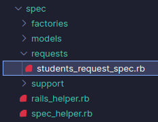
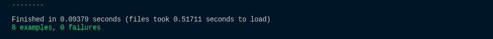

# Teste de controller

## Index:

Para o texto de Controllers, vamos usar o fluxo do **Desenvolvimento Orientado a Testes**, no qual, primeiro os testes são feitos e só depois o objeto de teste é criado.

Para começar os testes, dentro da pasta **spec** criaremos uma pasta com o nome de **requests** e, dentro dessa pasta, criaremos o arquivo **students_request_spec.rb**.



Disso, pode surgir uma dúvida: 'Por que estamos dando o nome de request e não de controller, como foi feito no caso da model?'.

A resposta é simples, para conseguir testar as controllers, vamos testar os requests. Caso testemos controllers, só será possível testar as ações dos controllers, testando requests além das ações, conseguimos testar rotas, sessões e, além de tudo, é o método recomendado pelo próprio Rspec.

Sabendo disso, podemos popular nosso arquivo **students_request_spec.rb**. A ideia é que a sintaxe básica não seja muito diferente da forma na qual testamos as models. Podemos, então, começar assim:

```ruby
require 'rails_helper'

RSpec.describe 'Students', type: :request do

end
```

Nossa sintaxe básica está pronta, logo podemos começar testando nossa index:

```ruby
require 'rails_helper'

RSpec.describe 'Students', type: :request do
    context 'GET #Index' do 
        it 'should show success status and render all students' do 
            get :index 
            expect(response).to have_http_status(:success)
        end
    end
end
```

Nesse teste, estamos pegando o **get :index** que é basicamente acessando a rota e, quando acessarmos essa rota, esperamos que nos devolva um status http de sucesso e mostre todos os estudantes criados, todavia, quando rodarmos o código, vai falhar, pois nosso index ainda não foi criado na controller.

Assim sendo, vamos criar o que falta e ver se nossa rota está funcionando.

Ainda não temos nossa Controller dos Students, então podemos criar uma com o seguinte comando no terminal:

`rails generate controller Students index`

Com esse comando, criamos a controller dos Students e já vem junto a ação index. Outro ponto que deve ser ressaltado é que, ao rodar esse comando, o próprio rspec vai criar a página de request dos Students, mas como nossa objetivo é aprender a usar a ferramenta, vamos fazer tudo do zero.

Ao gerar o controller dos Students, já recebemos a controller com o método index e a rota do método.

Controller:

```ruby
class StudentsController < ApplicationController
  def index
  end
end
```

Rota:

```ruby
Rails.application.routes.draw do
  get 'students/index'
end
```

Com esses dois arquivos feitos, podemos fazer algumas mudanças neles para padronizar nossos testes.

No controller dos Students:

```ruby
class StudentsController < ApplicationController
  def index
    students = Student.all
    render json: students, status: :ok
  end
end
```

Aqui temos um controller normal, a única diferença é que ele vai renderizar um json com todos os estudantes criados até então e, caso tudo dê certo, vai retornar o status de ok(200/success).

No routes:

```ruby
Rails.application.routes.draw do
  get 'students/index', to: "students#index", as: :student_index
end
```

Por fim, a mudança final no arquivo de teste de requests:

```ruby
require 'rails_helper'

RSpec.describe 'Students', type: :request do
    context 'GET #Index' do 
        it 'should show success status and render all students' do 
            get student_index_path
            expect(response).to have_http_status(:success)
        end
    end
end
```

A única diferença é que no lugar do **:index** estamos chamando o caminho que definimos como o index dos estudantes.

Agora, quando rodarmos nosso rspec teremos 8 exemplos e nenhuma falha.

Como já sabemos que nossos testes de model estão certos, o que podemos fazer é rodar o seguinte comando no terminal para verificarmos só os testes do request:

`rspec spec/requests/students_request_spec.rb`

Com esse comando estaremos testando apenas os requests da pasta **students_request_spec.rb** e teremos de retorno 1 exemplo e 0 falhas, mostrando que os testes do arquivo em questão foram bem sucedidos.

Por fim, o teste do index está feito.

## Create:

Com o teste do nosso método index feito, vamos criar agora o teste do create.

Primeiramente, precisaremos de um contexto e de um exemplo. O contexto é fácil, seria testar o **Post do método create**, já o exemplo inicial poderia ser criar uma estudante que tem todos os parâmetros válidos:

```ruby
context 'POST #create' do 
        it 'should create a student' do 
            
        end
end
```

Agora que temos nosso contexto e nosso primeiro exemplo prontos, precisamos de um caminho e um método para que possamos criar nosso usuário, então, no nosso arquivo **routes** adicionaremos a seguinte linha:

`post 'students/create', to: "students#create", as: :create_student`

Com essa linha estamos falando, basicamente, que vamos criar um usuário por meio do método **post** e que isso será feito pelo método **create** da **controller students**, por fim, o caminho para todo esse processo é o **:create_student** (create_student_path).

Com nossa rota feita, precisamos do método **create** na controller:

```ruby
def create
    student = Student.new(student_params)
    student.save!

    render student, status: :created
  rescue StandardError => e
    render json: { message:'Não foi possível criar um usuário' }, status: :bad_request
  end

  private 
  
  def student_params
    params.require(:student).permit(
      'name',
      'age'
    )
  end
```

Agora que temos nosso método, podemos começar, definitivamente, a fazer nossos testes do nosso create request:

```ruby
context 'POST #create' do 
        let(:student_params) do 
            {name:"Teste", age:20}
        end

        it 'should create a student' do
            post create_student_path, params: { student: student_params }
            expect(response).to have_http_status(:created)
        end
end
```

Nesse caso, estamos testando o exemplo de criarmos um estudante normal e funcional, para isso, usamos o **helper** do Rspec chamado de **let**. O **let** é usado para testar os parâmetros, diferente do build que estávamos usando para os testes de model, o let não pode ser invocado dentro de um **it**, só dentro do **context** e, então, conforme precisemos de alterações, vamos mudando.

Tendo entendido isso, o que estamos fazendo é criar uma variável com o nome de **student_params** e passando para ela um nome e uma idade, ambos válidos de acordo com nossa model. Nesse sentido, podemos seguir para o nosso exemplo.

Já no exemplo, estamos chamando um post que acessa o método de criar um estudante e usamos a palavra **params** para informar que o nosso método de criação vai receber alguns parâmetros e esses parâmetros seriam do tipo **student**(referente a model) e para os campos usamos o nome e a idade do **student_params**. Em suma, é como se estivéssemos tentando criar um usuário com o nome de "Teste" e a idade de 20.

Por fim, a última linha diz que esperamos que o nosso retorno tenha o status de **:created**.

Ao rodarmos o **rspec spec/requests/students_request_spec.rb**, devemos receber a seguinte saída no terminal:

`2 examples, 0 failures`

Tudo bem, mas como fazemos para testar um caso que o estudante não tem os parâmetros certos para ser criado?

Simples! Como podemos ver no nosso método create no controller, quando um usuário não tem o necessário para ser criado, esperamos que o resultado seja um **bad_request**, então, só precisamos passar parâmetros inválidos e esperar que nossa resposta seja condizente com a que passamos na controller.

```ruby
it 'should not create a student' do
            student_params = {name: 'oi'}
            post create_student_path, params: { student: student_params }
            expect(response).to have_http_status(:bad_request)
end
```

Dessa vez, estamos mudando o parâmetro **name** da variável **student_params** para **oi** e, assim, nossa variável para a ter um parâmetro inválido. Logo, nós queremos ter, como retorno, o status de **bad_request**, pois esse usuário não pode ser criado.

Assim sendo, logo que rodemos nosso teste teremos:

`3 examples, 0 failures`

## Show:

Como feito nos exemplos anteriores, precisaremos, primeiramente, de uma rota, logo após, precisaremos criar nosso método show na controller. Para nosso exemplo teremos:

Rota:

`get 'student/show/:id', to: 'students#show', as: :student`

Método:

```ruby
def show 
    student = Student.find(params[:id])
  
    render json: student, status: :ok
  rescue StandardError => e
    render json: { message:'Não foi possível encontrar o estudante' }, status: :bad_request
end
```

O diferencial do método show é o **find(params[:id])** e o **show/:id**, o que estamos dizaendo quando usamos isso é que, para ver um item em especial, precisamos do id, o id vai ser a **chave** que vai garantir que cada estudante seja único. Nesse sentido, precisamos passar isso também na hora de testar o método show.

```ruby
context "GET #Show" do 
        it 'with existing student' do 
             estudante = create(:student)
             get student_path(1)
             expect(response).to have_http_status(:ok)
         end

        it 'with non existing student ' do 
            get student_path(1)
            expect(response).to have_http_status(:bad_request)
        end
end
```

O que fizemos nesses testes? No primeiro, criamos um estudante com o **factory_bot**, logo, ele é usado apenas no escopo local, o que significa que o estudante que criamos dentro no primeiro exemplo, só existe naquele exemplo. Após a criação do estudante, pegamos nosso caminho e jogamos o id do estudante, como tudo dentro do exemplo é local, só temos um estudante e esse estudante é o que tem o id 1.

Então, é como se tivéssemos um banco de dados vazio e criamos um **student** dentro da variável estudante. Agora, temos um **student** e ele tem o id 1. Por fim, queremos tentar acessar esse **student**, então, usamos o **student_path** (student/show/**:id**), essa url precisa de um id, então passamos para ela o id 1, único id que temos, assim sendo, caso consigamos acessar o usuário, a resposta deve ser um **:ok**.

Pro segundo exemplo, a ideia é a mesma, só que dessa vez não criamos nenhum **student**, ou seja, quando tentarmos acessar o **student** com o id=1, cairemos no caso de erro da controller, que nos retorna um **:bad_request**.

Caso rodemos nosso Rspec novamente, teremos como retorno no terminal:

`5 examples, 0 failures`

## Update:

Como já passamos nos outros exemplos, aqui vamos definir, de forma rápida a rota e o método update.

Rota:

`patch 'students/update/:id', to: 'students#update', as: :update_student`

Para a rota, o a requisição pode ser tanto um **patch** quanto um **put**.

Método na Controller:

```ruby
def update 
    student = Student.find(params[:id])
    student.update!(student_params)

    render student, status: :ok
  rescue StandardError => e  
    render json: { message:'Não foi possível editar o estudante' }, status: :bad_request
  end
```

Assim sendo, agora podemos fazer o nosso test do Rspec.

```ruby
context "PATCH #Update" do 
        let(:estudante) { create(:student) }

        it 'should update student info' do 
            atualizado = { name: 'O aluno' }
            patch update_student_path(estudante), params: { student: atualizado }
            estudante.reload
            expect(estudante.name).to eq(atualizado[:name])
        end
end
```

Nesse exemplo, é bem parecido com o método show, ambos precisamos do **id**. Então, primeiramente, criamos um estudante pelo factory bot, após isso, podemos ir para o nosso exemplo.

No nosso exemplo, a primeira coisa que fazemos é criar uma variável com o nome de **atualizado** e, nessa variável, simulamos o campo name com a string de '**O aluno**'. Na linha seguinte, eu chamo a requisição do tipo **patch** e passo o caminho para atualizar o estudante e, entre parênteses, passo o estudante que quero atualizar, no nosso caso, o que foi criado no **factory_bot** e adicionado a variável estudante. Após isso, passo o **params**, para dizer o que quero atualizar, e, dentro desse **params** faço com que o nosso **student**(model) e passo para ele o que tem na variável **atualizado**.

Nesse sentido, o que eu fiz, brevemente, foi pegar a variável estudante e mudar o nome. Agora, precisamos verificar se o nosso estudante teve, realmente, seu nome modificado, para isso podemos usar o **reload**.

O **reload** vai recarregar a nossa variável estudante com os dados atualizados. Para que fazemos isso? a resposta está na última linha! Fazemos isso pois esperamos que o estudante.name seja igual ao nome que pegamos da variável atualizado. Ou seja, esperamos a variável estudante, após recarregada com o reload, tenha seu nome modificado para o que passamos dentro de **params**.

Para tentar deixar mais explicativo, podemos tentar fazer um fluxo:

Inicialmente, nosso estudante tem o nome de **Aluno**, mas queremos mudar esse nome, então, no nosso sistema, mudamos esse nome para **O Aluno**, para verificar se esse nome foi, realmente, modificado, salvamos o novo nome e recarregamos nosso estudante para verificar o novo campo, ao fazermos isso, percebemos que o nome do estudante agora é **O Aluno**, então, está de acordo com o esperado.

Ao rodarmos o rspec dos requests, teremos como resultado:

`6 examples, 0 failures`

## Delete:

Por fim, agora temos que testar o request do método delete. Esse método pode parecer um pouco diferente dos demais, mas também é bem simples.

Rota:

`delete "students/delete/:id", to: "students#delete", as: :delete_student`

Controller:

```ruby
def delete
    student = Student.find(params[:id])
    student.destroy!

    render student, status: :ok
rescue StandardError => e
    render json: { message:'Não foi possível deletar o estudante' }, status: :bad_request
end
```

Como já percebemos, tanto o método na controller quanto a rota pedem um **id**, logo isso vai ser importante na hora dos testes, assim como foi no show e no update.

Sabendo disso, podemos fazer o seguinte no Rspec:

```ruby
context "DELETE #Delete" do 
        let(:estudante) { create(:student) }
        it 'should delete the student' do 
            delete delete_student_path(estudante), params: { id: estudante.id }
            expect(Student.find_by(id: estudante.id)).to be_nil
        end
end
```

O teste do delete é bem parecido com o do update, passamos o estudante para o caminho de deletar um estudante e, para identificarmos de certeza qual é esse estudante, passamos seu id. Por fim, após a execução dessa linha, procuramos o id do estudante no nosso banco de dados e esperamos que esse id não seja encontrado, ou seja, **to be_nil**, caso isso seja verdadeiro, o teste passa e nosso método delete está funcionando.

O que podemos fazer, em conjunto com o expect, é adicionar uma linha para ver o retorno da requisição http.

```ruby
context "DELETE #Delete" do 
        let(:estudante) { create(:student) }
        it 'should delete the student' do 
            delete delete_student_path(estudante), params: { id: estudante.id }
            expect(response).to have_http_status(:ok)
            expect(Student.find_by(id: estudante.id)).to be_nil
        end
end
```

Quando rodarmos isso, além de checarmos se o id sumiu do banco de dados, também esperamos que a resposta à requisição que fizemos seja **:ok**, aí saberemos que nosso teste está 100% funcional.

Podemos também adicionar um exemplo que testa quando tentarmos deletar um estudante que já foi deletado:

```ruby
it 'with unvalid id' do
            estudante.destroy!
            delete delete_student_path(estudante), params: { id: estudante.id }
            expect(response).to have_http_status(:bad_request)
end
```

Na primeira linha desse exemplo, apagamos o estudante antes de tentarmos deletar ele com nosso método, então, ao chegar no nosso delete, não vai ter nada para deletar, então vai para o caso de erro e teremos, como resposta, um **:bad_request**.

Ao rodarmos o rspec nessa pasta teremos, como retorno o seguinte:



Assim sendo, todos nossos testes estão funcionais.

Por fim, só podemos fazer uma pequena modificação no nosso arquivo de rotas que ficou bastante repetitivo.

```ruby
Rails.application.routes.draw do
  get 'students/index', to: "students#index", as: :student_index
  post 'students/create', to: "students#create", as: :create_student
  get 'students/show/:id', to: 'students#show', as: :student
  patch 'students/:id', to: 'students#update', as: :update_student
  delete "students/delete/:id", to: "students#delete", as: :delete_student
end
```

Sempre repetimos o students, então podemos usar um **scope** para evitar tanta repetição. No fim, ficaria assim:

```ruby
Rails.application.routes.draw do
  scope 'students/' do 
    get 'index', to: "students#index", as: :student_index
    post 'create', to: "students#create", as: :create_student
    get 'show/:id', to: 'students#show', as: :student
    patch 'update/:id', to: 'students#update', as: :update_student
    delete 'delete/:id', to: 'students#delete', as: :delete_student
  end
end
```

Agora temos um arquivo de rotas mais organizado e nossos testes do rspec continuam funcionando.