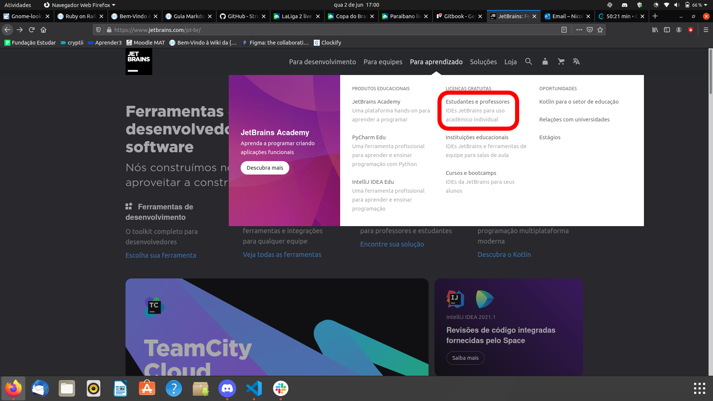
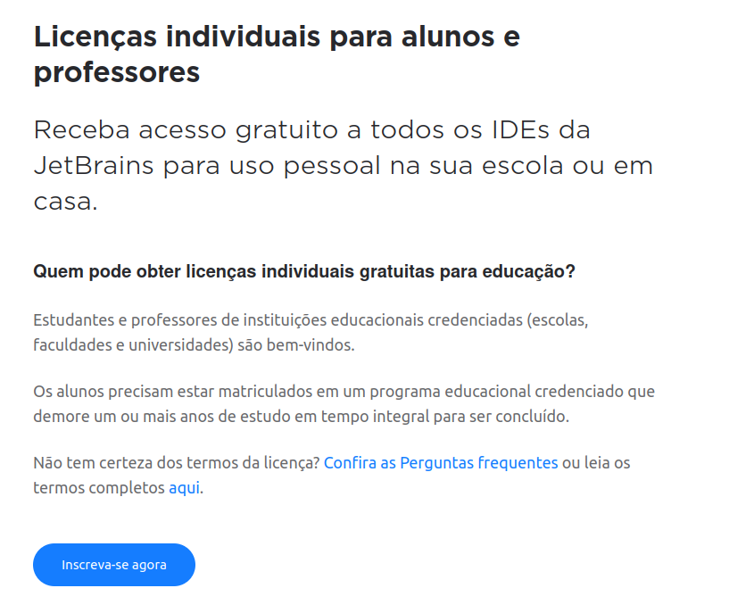
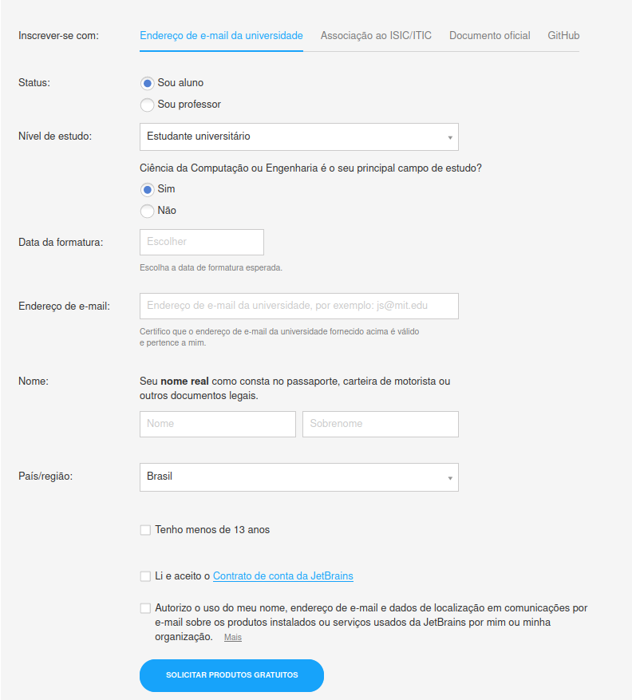
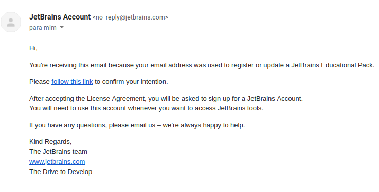
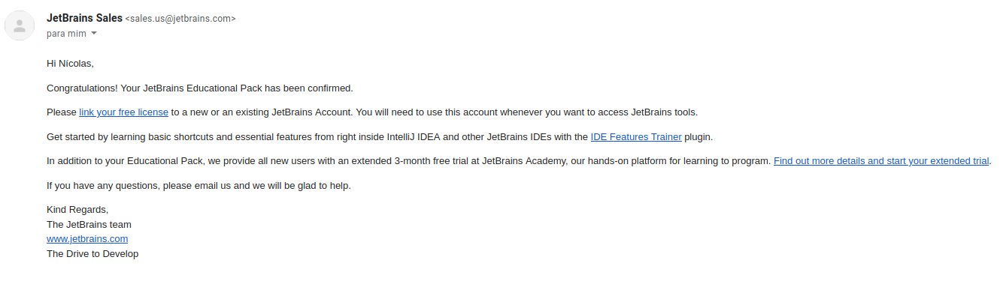

# Guia de obtenção de licença de estudante do RubyMine

Este é um guia passo a passo de como obter a licença Jetbrains com o email da UnB.

## Passo 1

Ao acessar o site da [Jetbrains](https://www.jetbrains.com/pt-br/), na aba **Para aprendizado**, na seção de **Licenças Gratuitas**, acessar o link **Estudantes e professores**

## Passo 2

Após acessar a página de Licenças para estudantes e professores, um pouco mais abaixo na página, clicar no botão **Inscreva-se agora**

## Passo 3

Na página de inscrição, preencher o formulário de acordo com as instruções e não esquecer de usar seu email da UnB, que é "000000000@aluno.unb.br".

## Passo 4

Após submeter o formulário, você receberá um email de confirmação.

## Passo 5

Acessando o link do email, você terá de concordar com os termos da Jetbrains. Após isso, você receberá um novo email para linkar sua licença de estudante a sua conta já existente.

## Final feliz

Pronto, agora você possui uma licença de estudante para baixar o RubyMine e outros programas da Jetbrains sem precisar se preocupar com pagamentos.