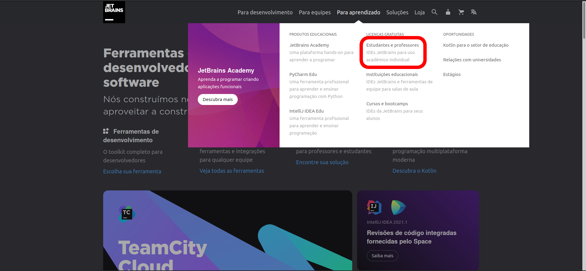

# Guia de obtenção de licença de estudante do RubyMine

Este é um guia passo a passo de como obter a licença Jetbrains com o email da UnB.

## Passo 1

Ao acessar o site da [Jetbrains](https://www.jetbrains.com/pt-br/), na aba **Para aprendizado**, na seção de **Licenças Gratuitas**, acessar o link **Estudantes e professores**

## Passo 2

Após acessar a página de Licenças para estudantes e professores, um pouco mais abaixo na página, clicar no botão **Inscreva-se agora**

