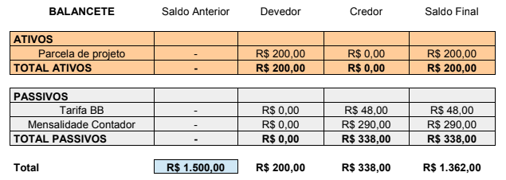
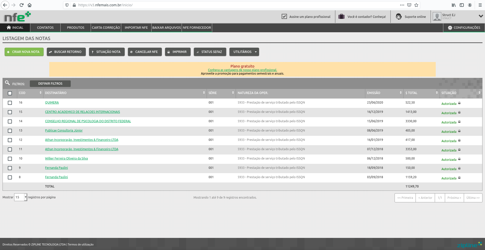
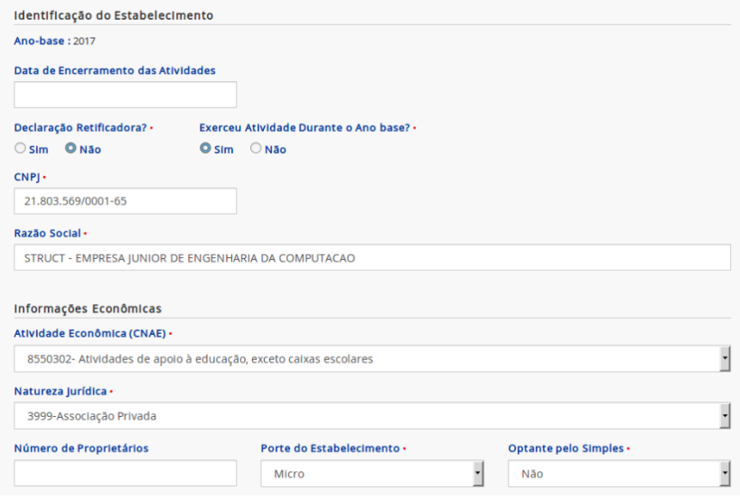
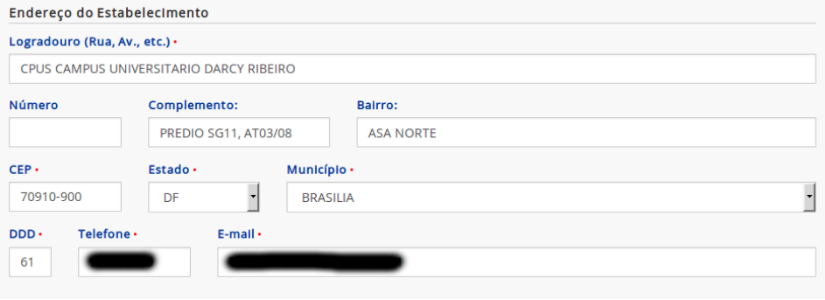
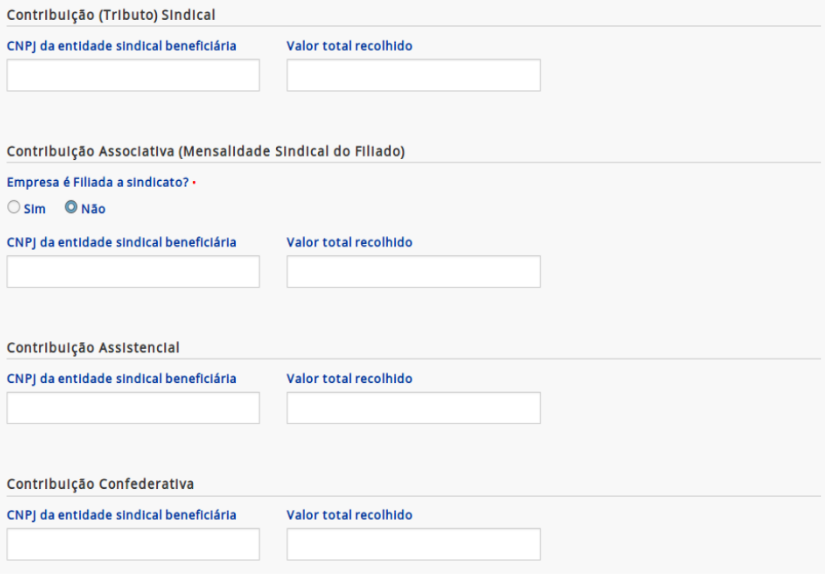

# Administrativo-Financeiro

A diretoria administrativo-financeira da Struct é o centro da burocracia e logística da empresa júnior. Documentos e dinheiro são as principais responsabilidades desta diretoria, mas ela também é responsável por cuidar da sede física e de outras responsabilidades administrativas relativas a empresa.

## Troca de gestão

Caso você tenha sido recentemente eleito como diretor\(a\) administrativo-financeiro da Struct, gostaria de parabenizá-lo! Embora essa nova atribuição venha com novas obrigações, essa seção irá detalhar todos os passos que devem ser tomados no início de sua gestão. Esses passos irão garantir que você seja, para todos os fins legais e burocráticos, identificado como diretor\(a\) administrativo-financeiro da Struct e possua as ferramentas necessárias para exercer sua função. Lembre-se que, caso haja alguma dúvida acerca do novo cargo, você sempre pode entrar em contato com os diretores e presidentes das gestões anteriores.

A troca de gestão acontece anualmente \(na Struct, geralmente é efetivada em março\) e o diretor\(a\) administrativo-financeiro da Struct deve organizar os documentos legais necessários para manter os nomes da diretoria da empresa atualizados. Será necessário levar no *cartório* os documentos **ata de eleição** e **termo de posse**, autenticá-los e registrá-los.

### Conta bancária

O primeiro passo para começar a exercer suas funções após lidar com os documentos de posse dos diretores é ter acesso à conta bancária da Struct, a qual é administrada em conjunto pelo\(a\) presidente e pelo diretor\(a\) administrativo-financeiro da Struct.

Para esse fim, será necessário que você e o\(a\) presidente da Struct compareçam presencialmente à sede do Banco do Brasil da UnB e apresentem alguns documentos que comprovem suas identidades juntamente com os documentos da troca de gestão para obterem acesso à conta bancária. Nesse dia, você também irá criar as senhas que você irá utilizar para ter acesso à conta bancária \(recomenda-se que você anote essas senhas em algum lugar\).

Após o acesso ter sido liberado \(isso demora alguns dias úteis\), você precisará retornar à sede para cadastrar os dispositivos que você irá utilizar para ter acesso à conta bancária. Recomenda-se levar o celular para baixar o app do Banco do Brasil e, talvez, um notebook para acessar o Banco do Brasil pelo website \(talvez seja necessário instalar um software de segurança no notebook\).

Com todos esses passos feitos, você poderá acessar a conta bancária da Struct utilizando sua senha alfanumérica e sua senha numérica de 8 dígitos. Mais detalhes sobre a conta bancária serão fornecidos na seção de [Obrigações financeiras](#obrigacoes-financeiras).

### Listagem de cargo oficial

Uma obrigação menor, mas de certa forma importante, após a sua posse é atualizar suas contas nos serviços utilizados pela Struct para que elas listem apropriadamente o seu novo cargo de *diretor\(a\) administrativo-financeiro*. A lista de contas a serem atualizadas inclui:

  * Assinatura eletrônica do seu email corporativo \(verifique com a equipe de marketing se eles já iniciaram o design de uma assinatura padrão para os membros da nova gestão\);
  * Cargo listado no *Slack* da Struct.

### Troca de representante da Struct

Caso o\(a\) presidente da empresa júnior seja alterado na troca de gestão, será necessário requisitar ao contador da empresa a troca do representante da empresa por meio do seu email corporativo. Para isso, será *provavelmente* necessário obter uma **via autenticada em cartório** dos seguintes documentos:

  * Ata aprovação nova diretoria;
  * Estatuto;
  * Documento de identidade com CPF \(ou CNH\) do representante que responde judicial e extrajudicialmente \(no momento, o membro que ocupa a presidência da Struct\).

Após os documentos terem sido entregues ao contador e uma pequena taxa ter sido paga ao contador \(mais detalhes sobre a realização de pagamentos podem ser encontrados na seção de [Obrigações financeiras](#obrigacoes-financeiras)\), o representante da empresa júnior será alterado.

### Modificações em documentos

Como diretor\(a\) administrativo-financeiro da Struct, seu nome deve constar em alguns documentos oficiais da Struct. Ao assumir o cargo, será necessário modificar esses documentos para que suas informações estejam neles. No momento, os seguintes documentos devem ser modificados:

* Modelo de contrato de prestação de serviços \(Endereço no Google Drive: "*Presidência -> Galeria de modelos -> MODELO_contrato_prestacao_servicos*"\).

## Obrigações financeiras

A parte financeira da diretoria envolve todo o controle do caixa relativo à empresa júnior. Isso inclui obrigações como contabilizar as movimentações financeiras da Struct, pagar os serviços utilizados pela empresa júnior \(como o contador, os gastos do servidor onde os nossos websites são hospedados, etc...\) e manter um histórico de todas as dívidas incorridas pelos membros da empresa júnior em nome da Struct \(pagas e pendentes\). Para exercer essas atribuições, será necessário ter acesso à conta bancária da Struct por meio das senhas geradas na troca de gestão.

### Aprovação de pagamentos

Todos os pagamentos feitos pela Struct devem ser aprovados pelo\(a\) presidente **e** e pelo diretor\(a\) administrativo-financeiro. Dessa forma, qualquer transação a ser feita não pode ocorrer sem que ambos esses diretores acessem a conta bancária da Struct. Uma transação é primeiro proposta por um desses diretores, que deve fornecer os detalhes da transação \(conta destino, valor, data de efetivação, etc...\) para, depois, o outro diretor verificar os detalhes e assinar a transação \(na seção de *Transações pendentes*\).

É importante escolher datas de efetivação da transação com uma certa folga em relação ao dia em que a transação é proposta, estar em contato constante com o\(a\) presidente e verificar se existem transações pendentes constantemente, **pois transações que não forem aprovadas por ambos até a data de efetivação não irão ocorrer**. Caso uma transação já tenha sido assinada tanto pelo\(a\) presidente como pelo diretor\(a\) administrativo-financeiro mas sua data de efetivação ainda não tenha chegado, a transação poderá ser visualizada na seção de *Lançamentos futuros*.

### Balancetes

Os balancetes são documentos mensais que consistem em uma planilha que contém toda e qualquer movimentação de dinheiro dentro da empresa. Como diretor\(a\) administrativo-financeiro, é sua obrigação fazer os balancetes no começo de cada mês, referentes ao mês anterior \(quando os gastos mensais já estiverem fechados\).

  
  
Exemplo de balancete

No começo do mês, o primeiro passo para a realização do balancete consiste no obtenção do extrato da conta bancária da Struct, o que é feito por meio do aplicativo ou do website do Banco do Brasil. Esse extrato é um arquivo *pdf* que deve ser adicionado ao Google Drive na pasta "*Administração e Financeiro -> Balancetes -> [Ano da sua gestão] -> Extratos*" com o nome "*[Número do mês] - [Nome do mês]*". Após o extrato ter sido adicionado ao Google Drive, você deve criar \(por meio do próprio Drive\) um documento do tipo "*Planilhas Google*" com base no modelo "*balancete_x*" e preencher esse documento com os ativos \(dinheiro recebido\) e passivos \(gastos\) presentes no extrato bancário desse mês.

O valor dos ativos sempre será colocado na coluna "*Devedor*" e o valor dos passivos, na coluna "*Credor*". Procure sempre descrever o ativo/passivo de forma clara e não ambígua, indicando se ele constitui uma parcela de projeto ou pagamento específico. Além disso, lembre-se de preencher o campo "*Total*" da coluna "*Saldo anterior*" com o saldo inicial do mês. Se tudo tiver sido preenchido corretamente, o campo "*Total*" da coluna "*Saldo final*" deve conter o saldo final do mês conforme indicado no extrato \(se isso não ocorrer, verifique se todos os ativos e passivos foram adicionados corretamente\). Salve o balancete gerado na pasta "*Administração e Financeiro -> Balancetes -> [Ano da sua gestão] -> Planilhas*" com o nome "*[Número do mês] - [Nome do mês]*". Em caso de dúvidas, consulte os balancetes dos meses anteriores.

Após gerar o extrato e preencher o balancete de um mês, envie uma cópia de ambos os documentos para o contador da empresa.

### Contador

A Struct paga uma empresa de contabilidade para a realização de serviços necessários ao funcionamento da Struct. Esses serviços incluem a emissão de documentos necessários para regularizar a situação fiscal da empresa júnior, a alteração do representante legal da Struct e a realização de serviços adicionais.

Como diretor\(a\) administrativo-financeiro da Struct, cabe a você realizar os pagamentos à empresa de contabilidade \(os quais devem ser aprovados pelo\(a\) presidente da Struct\), enviar qualquer documento pedido pela empresa de contabilidade para a realização de seus serviços e requisitar serviços e documentos necessários à Struct \(como a emissão de documentos relativos ao selo EJ\). Lembre-se que essa comunicação geralmente é feita pelo email corporativo da empresa.

### Fiscalização de parcelas

Os clientes que contrataram a Struct possuem a obrigação de realizar o pagamento do valor acertado no contrato, geralmente por meio de transferências para a conta bancária da Struct. Como diretor\(a\) administrativo-financeiro da Struct, você possui a função de fiscalizar que os pagamentos de parcelas dos contratos estão ocorrendo de forma regular, registrar qualquer alteração no cronograma de pagamentos e informar o resto da empresa júnior quando algum cliente estiver devendo dinheiro para a Struct.

É importante para a fiscalização de parcelas que certas informações básicas sejam registradas sempre que um novo contrato é fechado pela Struct. Essas informações incluem o nome do cliente, a natureza do contrato \(desenvolvimento, manutenção ou consultoria\), o faturamento total esperado do contrato, o faturamento total recebido com o contrato, as parcelas a serem pagas com suas respectivas datas de pagamento e quaisquer informações relacionadas ao adiamento de parcelas ou calotes dados pelos clientes. Além disso, possíveis comprovantes de pagamento enviados pelos clientes devem ser armazenados e organizados.

Para a obtenção de algumas dessas informações, você deverá entrar em contato com o diretor\(a\) de projetos da Struct para que este\(a\) te notifique quando um novo contrato for assinado e te informe acerca das informações de pagamento desse contrato. Outras informações poderão ser obtidas por meio do acompanhamento dos extratos da conta bancária da Struct.

Caso algum cliente requisite um adiamento no pagamento das parcelas, esteja com alguma parcela pendente ou realize um calote, notifique os diretores da Struct, em especial o\(a\) presidente, assim que possível para que uma decisão possa ser tomada sobre o que fazer diante dessa situação.

No momento, toda essa fiscalização está sendo feita por meio do **Trello** da diretoria de ADM-FIN, mas sinta-se livre para adotar qualquer outro meio para registrar essas informações.

### Notas de entrada e saída

As notas de entrada e saída são notas fiscais emitidas com o CNPJ \(Cadastro Nacional de Pessoa Jurídica\) da Struct. Como as notas de entrada e saída devem conter o CNPJ da Struct, é comum que elas sejam notas fiscais relativas a contratos assinados pela Struct e não notas fiscais de gastos simples feitos pelos membros da empresa júnior.

As notas de entrada representam ativos para a empresa júnior e geralmente são notas fiscais eletrônicas emitidas quando um projeto termina de ser pago pelo cliente \(veja [essa seção](#notas-fiscais-eletronicas) para mais detalhes\). Enquanto isso, as notas de saída representam passivos \(gastos\) para a Struct e geralmente são notas fiscais fornecidas pelas empresas contratadas pela Struct quando a última parcela do contrato é paga \(caso isso não ocorra, entre em contato com a empresa contratada para requisitar a emissão da nota fiscal\).

Tanto as notas de entrada como as notas de saída devem ser enviadas para o contador da empresa assim que possível, tarefa que cabe a você, diretor\(a\) administrativo-financeiro da Struct.

### Notas fiscais eletrônicas

Uma nota fiscal eletrônica é um documento eletrônico que serve para documentar a prestação de serviços realizada pela Struct. Este documento é geralmente emitido quando o cliente finaliza o pagamento das parcelas do projeto ou, mais raramente, a pedido do cliente. Como diretor\(a\) administrativo-financeiro da Struct, é sua obrigação emitir as notas fiscais eletrônicas de cada projeto da Struct e enviá-las para o cliente do projeto e para *o contador* assim que possível.

Para emitir uma nota fiscal eletrônica, utilize a conta da Struct para acessar a plataforma da [NFE+](https://www.nfemais.com.br/) \(caso você não saiba a conta da Struct para a plataforma NFE+, pergunte essa informação para o presidente atual da Struct ou para o último membro a ocupar a função de diretor administrativo-financeiro\). Abaixo, segue uma imagem da tela inicial da plataforma.

  
  
Tela do site NFE+

Ao clicar no nome de um destinatário, na segunda coluna, é possível ver as informações daquela nota fiscal, o que ajuda no preenchimento de novas notas fiscais em casos de dúvidas. Tome um momento para se familiarizar com as notas fiscais existentes porque isso ajudará a sanar quaisquer dúvidas relativas ao processo como um todo de forma muito mais rápida que fazer perguntas para os últimos diretores administrativo-financeiros da Struct \(eu falo por experiência própria :grin:\).

#### Emissão de uma nota fiscal eletrônica

Para emitir uma nota fiscal eletrônica, basta clicar em “Criar nova nota” e seguir os seguintes passos:

1. Na região "Dados gerais", alterar o campo "Destino da operação" para "Operação interna".

2. Na região "Dados do destinatário", preencher os campos do cliente do serviço e utilizar a plataforma [SINTEGRA](http://www.sintegra.gov.br/) para consultar a inscrição estadual e verificar o ICMS a ser preenchido. Caso a plataforma retorne a mensagem "CONTRIBUINTE NÃO CADASTRADO COMO CONTRIBUINTE DE ICMS.", altere o valor do campo "Indicador de IE" para "Não contribuinte".

3. Na região "Lista de produtos", clique em inserir item, e altere o campo "Dados gerais do ..." de "Produto" para "Serviço". No campo "Nome do serviço", clique na lupa lateral "Listar 50" e escolha "Aplicação web" ou "Hospedagem aplicação web". No campo "Refer. GTIN/EAN", escreva “SEM GTIN” e alterar o campo "Valor unitário" para o valor da parcela da nota fiscal a ser emitida \(coloque o valor total de todas as parcelas do projeto pagas até então\). Na região "ISSQN", clique em “buscar” no campo "Item lista serviço" e escolha o mais pertinente \(geralmente o item 01.01 - Análise e desenvolvimento de sistemas ou o item 01.07 - Suporte técnico em informática [...] \) e preencha o campo "Alíquota ISSQN \(%\)" \(2% no momento, mas verifique essa informação pesquisando no *Google*\). Na região "PIS", preencha o campo "Situação tributária" como "08: Operação sem Incidência da contribuição". Na região "COFINS", preencha o campo "Alíquota COFINS" \(7,6% no momento, mas verifique essa informação pesquisando no *Google*\). Por fim, respire fundo e clique em "Salvar".

4. Na região "Informações de serviços", marque o checkbox "Informar dados de serviços" e deixe o campo "Regime de tributação" em "Microempresa municipal".

5. Na região "Dados do transporte", altere o campo "Modalidade de frete" para "9 – Sem Ocorrência de Transporte".

6. Por fim, basta salvar e enviar a nota fiscal e esperar o status de “Autorizada” na coluna de "Situação" da mesma. Quando isso ocorrer, clique no minúsculo ícone de impressora ao lado do texto "Autorizada" para baixar a nota fiscal eletrônica. Salve o documento baixado no *Google Drive* na pasta "*Administração e Financeiro -> Nota Fiscal Eletrônica -> [Ano da sua gestão] -> [Número do mês] - [Nome do mês]*" com o nome "*NFE[Número da nota fiscal] - [Nome do cliente]*". Após salvar o documento, envie ele para o contador da empresa e para o cliente do projeto assim que possível.

#### Pagamento de COFINS e ISS

Todo o mês em que ao menos uma nota fiscal eletrônica for emitida e enviada para o contador, a Struct terá que realizar o pagamento dos impostos COFINS e ISS sobre todas as notas fiscais eletrônicas emitidas naquele mês. Os documentos bancários utilizados para a realização do pagamento são gerados pelo próprio contador e enviados geralmente na metade do mês seguinte à emissão das notas fiscais eletrônicas. Como diretor\(a\) administrativo-financeiro da Struct, é sua responsabilidade realizar esses pagamentos.

Para realizar o pagamento desses impostos, utilize a seção "*Pagamentos -> Leitor de código de barras*" do site ou do aplicativo do Banco do Brasil. O leitor de código de barras propriamente dito geralmente não funciona, mas a tela do leitor fornece as opções "Digitar código" e "Abrir PDF", as quais funcionam. Após o documento de pagamento ser reconhecido, o pagamento deve ser agendado e designado como "Débito na conta corrente". Por fim, não se esqueça de pedir para que o\(a\) presidente da Struct aprove a transação e de enviar os comprovantes de pagamento para o contador.

### Pagamento de dívidas

Muitas vezes, os membros da Struct realizam gastos em nome da empresa júnior, como, por exemplo, na autenticação de documentos em cartório, na confecção de material publicitário e na compra de comida para alguma atividade da empresa júnior \(por exemplo, pizza no fim de um coding day :pizza:\). Como diretor\(a\) administrativo-financeiro, é sua obrigação registrar essas dívidas contraídas pela Struct para com os seus membros e pagar elas assim que possível.

Para registrar as dívidas da Struct, utilize a planilha "*Administração e Financeiro -> Dívidas/Gastos/Projetos -> Dívidas*" e anote a data da dívida, em que consistiu o gasto, qual membro realizou o gasto, o valor do gasto e se o gasto foi pago ou não. Assim que possível, entre em contato com o membro que realizou o gasto, obtenha as informações de pagamento do membro, realize uma transferência da conta bancária da Struct para o membro no valor referente a dívida e, por fim, marque a dívida como paga na planilha.

A planilha de dívidas também possui campos que indicam o total da dívida da Struct para um membro específico, permitindo que um único pagamento seja realizado para sanar várias dívidas contraídas por esse membro. Para configurar a lógica desses campos, basta você colocar o nome do membro na coluna "*A QUEM*" \(embaixo do total da dívida da Struct\) e utilizar os textos "SIM" e "NÃO" \(em caixa alta\) na coluna "*PAGO?*".

## Obrigações administrativas

A parte administrativa da diretoria envolve o gerenciamento de documentos e o cumprimento de obrigações necessários para que a Struct desempenhe suas atividades de forma adequada. Isso inclui tarefas como o cumprimento do selo EJ e das demais obrigações legais impostas pelo MEJ \(Movimento Empresa Júnior\), a organização e manutenção do espaço sede da empresa júnior e o gerenciamento das demais divisões da diretoria administrativo-financeira.

### Selo EJ

O selo EJ é um selo criado pela Concentro, com o objetivo de garantir um mínimo de segurança jurídica às organizações ao proporcionar credibilidade para a empresa júnior frente aos seus *stakeholders*. Além disso, o selo EJ também possui o propósito de trazer uniformidade ao Movimento Empresa Júnior brasileiro. Como diretor\(a\) administrativo-financeiro da Struct, é sua obrigação coordenar com o\(a\) presidente da Struct a entrega dos documentos necessários para a emissão do selo EJ a cada ano, verificando regularmente os prazos de entrega no portal Brasil Júnior. Esses documentos também devem ser adicionados ao *Google Drive* na pasta "*Administração e Financeiro -> Selo EJ -> Selo EJ [Ano da sua gestão]*".

No *Google Drive*, existem modelos para os documentos necessários na pasta "*Administração e Financeiro -> Modelos*" e exemplos de documentos utilizados para o selo EJ nos anos anteriores nas pastas "*Administração e Financeiro -> Selo EJ -> Selo EJ [Anos anteriores a sua gestão]*".

Nas subseções abaixo, temos o detalhamento de alguns documentos geralmente requisitados para o selo EJ.

#### 1. Estatuto social

Caso **não** existam mudanças no estatuto social da Struct em relação ao ano anterior, sinta-se livre para utilizar o documento enviado para o último selo EJ. Caso contrário, o novo estatuto social precisa ser registrado oficialmente. Para isso, basta levar no cartório de pessoa jurídica os seguintes documentos:
  - Estatuto social alterado
  - Ata da assembleia em que foi discutida a mudança do estatuto
  - Requerimento de registro da ata em questão
  - Requerimento de registro do estatuto em questão

#### 2. Ata de eleição e termo de posse da gestão em exercício

Esses documentos também precisam ser registrados oficialmente. Para isso, levar no cartório de pessoa jurídica os documentos em questão.

#### 3. FCPJ ou QSA

Esses documentos são emitidos pelo contador mas possuem como pré-requisito a [troca de representante da Struct](#troca-de-representante-da-struct). Assim que o\(a\) presidente da Struct atual estiver cadastrado\(a\) oficialmente como representante da Struct, basta pedir ao contador para ele emitir o FCPJ \(ou o QSA\) e enviar no portal o documento recebido.

#### 4. CNPJ

Para obter esse documento, basta entrar no [site de emissão de comprovante de inscrição e situação cadastral do CNPJ da Receita Federal](https://goo.gl/qW4zxS), preencher os dados requeridos \(CNPJ da Struct: 21.803.569/0001-65\) e baixar o comprovante dado.

#### 5. Certidão Negativa de Débitos \(CND\) federal

Para obter esse documento, basta acessar o [site da Receita Federal, na parte de emissão de certidão negativa de débitos](https://goo.gl/DajJGt), digitar o CNPJ da Struct \(21.803.569/0001-65\), realizar a emissão de nova certidão \(dependendo da data de validade da primeira\) e baixar o arquivo gerado.

#### 6. Certidão Negativa de Débitos \(CND\) municipal

Para obter esse documento, basta acessar o [site da Secretaria de Estado de Fazenda do DF, na sessão de emissão de certidão negativa](https://goo.gl/TZ8co6), marcar a opção pessoa jurídica, digitar o CNPJ da Struct \(21.803.569/0001-65\), marcar a finalidade "Verificação de Débitos" e o tipo "Certidão de Débitos", e consultar e baixar o arquivo gerado.

#### 7. RAIS Negativa

A RAIS Negativa é um documento que pode ser emitido no [site da RAIS](https://goo.gl/eF3h23). Para o preenchimento dos campos de formulário, utilize as imagens abaixo como base.

  
  
Tela 1

  
  
Tela 2

  
  
Tela 3

  
  
Tela 4

Observações:
  - A atividade econômica e natureza jurídica da empresa júnior podem ser encontradas no documento do CNPJ.
  - O porte da empresa júnior diz respeito à receita produzida em um ano, seguindo a seguinte relação como referência: até 360k, micro empresa, e até 3600k, pequena empresa.
  - Para certificar se a empresa júnior é optante pelo Simples ou não, basta consultar [esse site](https://goo.gl/1kc4Pn).
  - Na aba de endereço do estabelecimento \(Tela 2\), a imagem não mostra o email e telefone digitados para não comprometer a privacidade de ex-membros da Struct, mas é importante que os dados \(endereço, email, telefone...\) estejam de acordo com o que está cadastrado no CNPJ também.
  - A aba de responsável pela declaração \(Tela 4\) deve ser preenchida com os dados de quem está gerando o documento.

Depois do preenchimento das telas, basta enviar a declaração e pegar o comprovante de envio.

#### 8. Comprovante de conta bancária ativa

Esse documento possui como pré-requisito o acesso à [conta bancária da Struct](#conta-bancaria). Quando a nova gestão possuir acesso à conta bancária da Struct, o\(a\) presidente ou o\(a\) diretor\(a\) administrativo-financeiro da Struct deve entrar no site do banco, navegar até a aba de conta corrente e emitir o extrato de conta corrente. Qualquer mês a partir de Janeiro do ano da auditoria serve.

#### 9. Livro diário ou Escrituração Contábil Digital \(ECD\)

O livro diário é redigido pelo contador, mas deve ser registrado em cartório de pessoa jurídica \(2° Ofício de Pessoa Jurídica\), sendo necessário estar encadernado em capa dura, possuir os termos de abertura e fechamento assinados pelo contador e pelo representante da EJ e um requerimento para registro assinado pelo representante legal atual. Custa em torno de R$190,00.

Alternativamente, a Escrituração Contábil Digital \(ECD\) é um documento que substitui o livro diário para os termos do selo EJ e que possui a vantagem de ser completamente digital \(ou seja, não é necessário ir ao cartório\). No momento, a parceria da CONCENTRO com o contador faz com que o custo dele seja gratuito.

#### 10. Contrato de serviço

Para obter esse documento, basta escanear um contrato de prestação de serviços a algum cliente assinado pelo cliente e pela Struct.

#### 11. Nota fiscal

Esse documento consiste em uma nota fiscal eletrônica emitida a partir de Outubro do ano anterior ao do selo. Para mais informações sobre como emitir uma nota fiscal eletrônica, visite [essa seção](#emissao-de-uma-nota-fiscal-eletronica).

#### 12. Declaração e Termo de voluntariado

Esses documentos consistem, respectivamente, no documento de dados pessoais de todos os membros da Struct assinado pelo\(a\) presidente e em um exemplo de termo de voluntariado de qualquer membro assinado pelo membro e também pelo\(a\) presidente.

#### 13. Comprovante de reconhecimento da IES

Este documento é redigido pela Struct e assinado tanto pelo\(a\) coordenador\(a\) do curso de Engenharia de Computação como pelo\(a\) orientador\(a\) da Struct. Um modelo do documento pode ser encontrado no *Google Drive* em "*Administração e Financeiro -> Modelos -> Institucional*".

### Sede

A sede da Struct é uma sala localizada no prédio SG-11 da Universidade de Brasília \(UnB\). Como diretor\(a\) administrativo-financeiro da Struct, é sua obrigação garantir que a sede esteja sempre limpa e bem organizada, de forma que todos os membros possuam usufruir desse espaço e que ele forneça uma boa impressão da empresa júnior para visitantes. A boa organização da sede deve permitir que qualquer documento ou item seja facilmente encontrado por algum dos membros da Struct. Por fim, o gerenciamento dos item que estejam em falta na sede \(marcadores, papel, inseticida, etc...\) também é uma função da diretoria administrativo-financeira.

### Divisão de R&D

A divisão de R&D \(Pesquisa e Desenvolvimento\) possui a missão de pesquisar as ideias que surgirem dentro da empresa, incluindo as vantagens, desvantagens, custos, implementações, possíveis treinamentos e outros aspectos relativos a uma ideia. Essa pesquisa tem o propósito de gerar informações relevantes para a tomada de decisões por parte dos diretores da empresa júnior, motivando a inovação constante dentro da Struct. Como diretor\(a\) administrativo-financeiro da Struct, cabe a você supervisionar o funcionamento dessa divisão ou delegar essa supervisão a um subordinado.

Quando uma ideia é proposta para a divisão de R&D, um dos membros da diretoria administrativo-financeira da Struct deve ser escolhido para pesquisar aquela ideia e escrever os resultados encontrados. Essa pesquisa deve levar no máximo umas 2-3 semanas e deve resultar em um relatório \(existe um modelo no *Google Drive* chamado "*Relatório de pesquisa e desenvolvimento \(R&D\)*"\), o qual será entregue para os diretores da Struct. Esse relatório é bem simples, tendo aproximadamente 1 página \(afinal de contas, o curso de Engenharia da Computação já possui trabalhos escritos que chega :sweat_smile:\), e deve providenciar as informações básicas mais importantes resultando da pesquisa.

No momento, o acompanhamento das ideias propostas para a divisão de R&D é feito pelo *Trello*, mas sinta-se livre para utilizar qualquer outro meio para essa finalidade.
