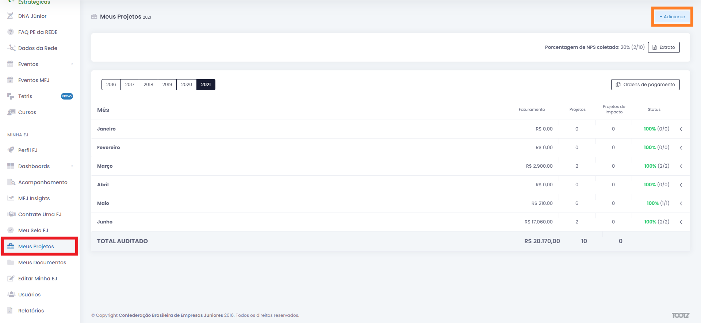
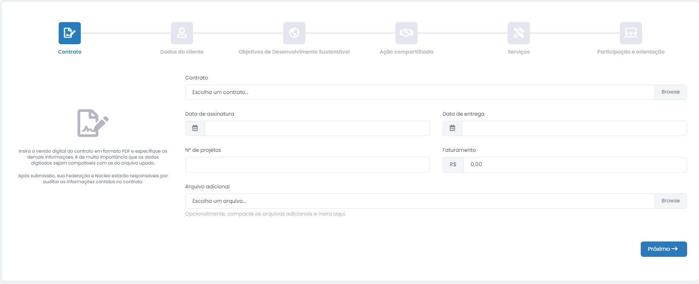
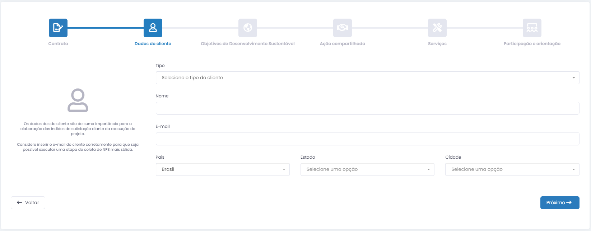
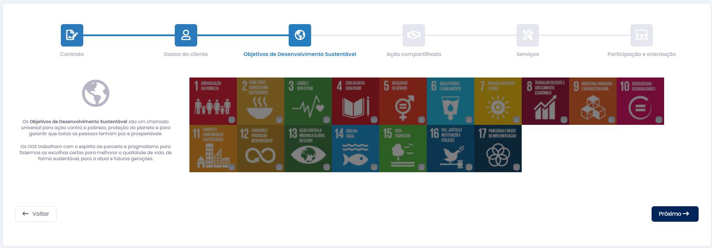
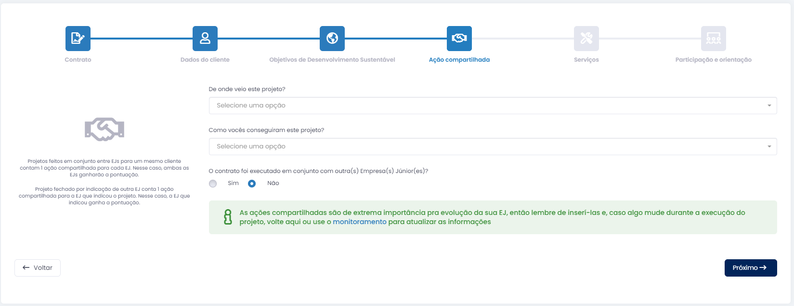
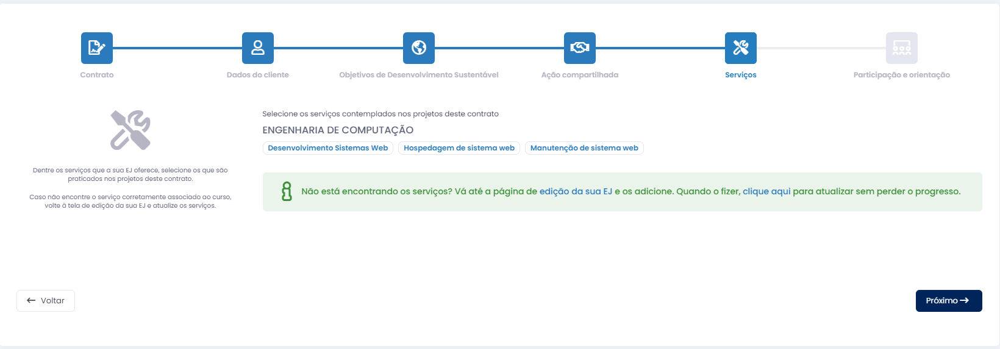
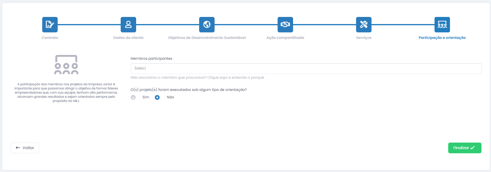
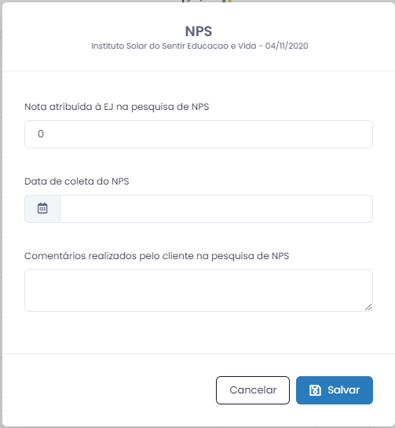

# Inserção de Projetos no Portal BJ
Boa parte dos objetivos que a Struct tem em um ano são relacionadas às metas definidas em conjunto com a Brasil Júnior e Concentro, e dessas, quase todas requerem que registremos o nossos contratos e projetos fechados no portal da Brasil Júnior.
Como todos os membros da Struct são orientados a se cadastrar no [portal](https://brasiljunior.org.br/) ao entrarem na empresa, apenas siga para o site e faça o seu login para começar a adicionar projetos ao portal.

### Página *Meus Projetos*

Comece procurando pela aba *Meus Projetos* na barra lateral do portal. Nela, clique no botão *Adicionar* para começar a inserção de um novo contrato.

### Inserção do contrato

Aqui, comece fazendo o upload do PDF assinado do contrato e insira informações como a data da assinatura, data prevista para entrega e o faturamento total do contrato.
O campo *N° de projetos* é menos definido, houve membros no passado que consideraram cada mês num projeto de manutenção como um projeto a parte por exemplo. Há também a possibilidade de, num projeto de site + aplicativo, considerar o back-end, o site e o aplicativo cada um como um projeto separado. Faça sua escolha do número com o que você achar mais adequado em relação ao contrato sendo inserido.
Por último, nessa etapa, você tem a opção de inserir documentos adicionais relacionados ao projeto, se existirem.

### Dados do cliente

Aqui é bem direto, insira os dados do cliente de acordo com o que está declarado no contrato. Só note que, no campo *Estado*, o DF não aparece como opção, selecione *Brasília* no lugar.

### Objetivos de Desenvolvimento Sustentável

Uma das metas da Brasil Júnior com as EJs é a de projetos de impacto, e é exatamente essa etapa que define se nosso projeto se caracteriza como um. 
Analise o contrato sendo adicionado e as opção de seleção disponíveis no site para ver se o projeto se encaixa em alguma categoria. Note que, muitos dos projetos feitos pela Struct se encaixam em *Indústria, Inovação e Infraestrutura* ou *Trabalho descente e crescimento econômico*.

### Ação compartilhada

Nessa etapa, insira de onde veio o projeto e se ele será feito em parceria com outra empresa júnior.
Note que, quando o projeto veio de uma outra empresa júnior, a empresa que indicou ganha um ponto de ação compartilhada e quando o projeto está sendo feito junto com outra EJ, ambas ganham uma ação compartilhada.

### Serviços

Aqui, simplesmente selecione quais dos serviços que a Struct oferece se encaixam com o contrato selecionado.

### Participação e Orientação

Na última etapa, alinhe com o pessoal da diretoria de projetos para definir quem estará trabalhando nesse projeto e insira cada participante nessa etapa. Também insira se há algum orientador nesse projeto, o que normalmente não é o caso na Struct.
Por fim, finalize o envio e aguarde o contrato ser auditado pela Brasil Júnior.

### Avaliação NPS
Lembre-se que outra meta importante para a empresa é a avaliação NPS. Quando um projeto chegar ao fim, a diretoria de comercial ou o gerente do projeto deve enviar o formulário NPS do ano.

Para adicionar a resposta de um NPS, vá a pagina *Meus Projetos* novamente, procure pelo projeto desejado e clicar no botão de NPS na parte direita da barra do projeto. Após isso, simplesmente preencha com os campos com as informações coletadas.