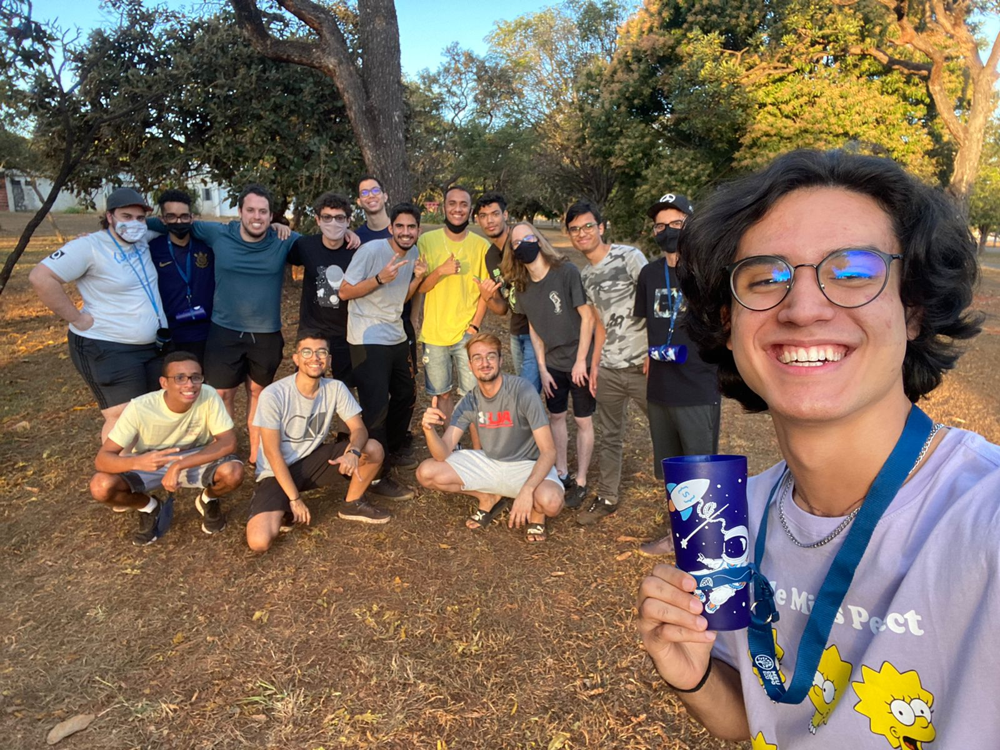
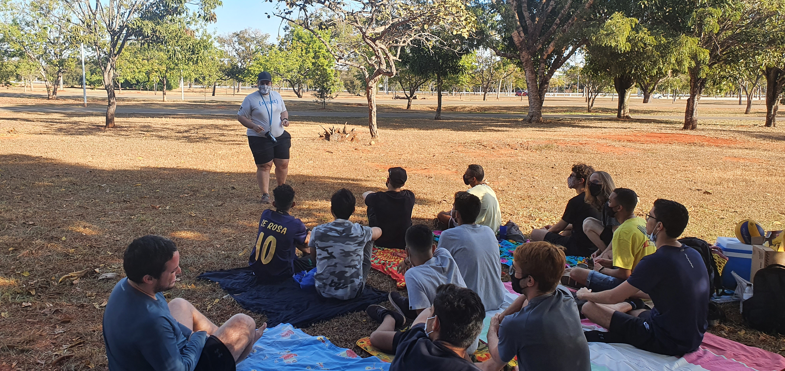

# Dia da Cultura

## Introdução

O Dia da Cultura é um organizado pela GP, onde a primeira ocorrência ocorreu no dia 16 de Julho de 2022, perto do estacionamento 7 do Parque da Cidade. No evento participaram 15 pessoas, sendo 10 membros e 5 pós-membros.

## Objetivos

O objetivo do evento é apresentar aos participantes de maneira bem informal, a cultura da Struct e de Empresa Júnior em geral, mantendo o foco principalmente na nossa empresa. A forma de apresentar esses assuntos pode ser feita de diversas formas, como por exemplo: histórias e acontecimentos da empresa, MVV, mini-palestras e dinâmicas. Além do momento cultural, é reservado também um período livre para descontrair, podendo praticar esportes, jogar cartas ou até ficar conversando (nessa parte, a regra é não ter regras).

## Aplicação

- 15:00 - Momento de chegada do pessoal no estacionamento 7, movemos para um local próximo do estacionamento, com grama e árvores em volta e estendemos os lençóis/cangas na na grama.
- 15:30 - Dinâmica quebra gelo, onde cada um pensou em alguma coisa que seja interessante para ela e comentou com a pessoa que estava do lado. Depois teve algumas rodadas onde o pessoal misturou e contou para outra pessoa aleatória a informação que uma pessoa da rodada anterior passou pra ela (essas pessoas não podem se repetir entre si).
- 15:50 - MVV, apresentado pelo Gabriel Cruz, e palestra, apresentado pelo Cubo. Na palestra, o cubo falou como era o início da Struct até o período pré-pandemia.
- 16:15 - Lanche, com bolinho ana maria, pringles, monster e picolé (tinha água para reabastecer as garrafas durante todo o evento).
- 16:30 - Rascunho do hino onde escolhemos primeiramente algumas músicas, eleger a melhor para usar como base, a escolhida foi Lancinho, da Turma do Pagode. Depois, separou em 3 grupos para pensar na introdução, meio e refrão. Cada grupo escolhe uma pessoa para liderar. Os grupos passam 5 minutos para pensar em algumas ideias e o líder anota todas no caderno. Passado os 5 minutos, os grupos mudam de posição, menos o líder (o grupo da intro vai para o meio, que vai para o refrão, que vai para a intro, gerando uma estrutura cíclica). Depois de cada grupo ter passado em cada etapa, juntou todo mundo e os líderes comentaram sobre as ideias.
- 16:55 - Sorteio das três camisas da antiga versão da Struct. Usou a dinâmica chamada Bang. Nessa dinâmica faz um círculo com todos os integrantes e uma pessoa no meio para ditar o fluxo do jogo (líder), a pessoa do centro roda e atira em uma pessoa aleatória do círculo. A pessoa que recebeu um tiro tem que abaixar e as duas pessoas do lado dela precisam atirar uma na outra, o eliminado é a pessoa mais lenta (tanto a pessoa que atira por último, quanto a pessoa que não abaixa a tempo). Essas etapas continuam até sobrarem duas pessoas, que fazem um faroeste diferente para disputar a camisa. O líder fala sobre 2 tipos diferentes (por exemplo: fruta e vegetal), e dita um para andar e outro para atirar, quando for a hora de atirar, a pessoa mais rápida no gatilho ganha a camiseta.
- 17:20 - Horário livre, teve jogo de recorde (vôlei) e conversa.