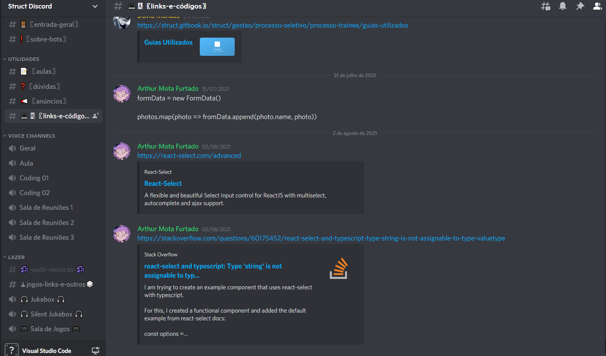

# Nossas Ferramentas

Nesta página, iremos apresentar a vocês, caros trainees, tudo que vocês precisam saber sobre as ferramentas que utilizarão ao longo de sua jornada aqui dentro da Struct.

## Discord

Aposto que a grande maioria já conheça o discord, basicamente é uma plataforma de comunicação via texto e/ou áudio e será a nossa principal plataforma para realizar reuniões, aulas ao vivo, tirar dúvidas e até para codarmos juntos!

### Por quê o discord?

Bom, com a chegada da pandemia, precisávamos nos adaptar, passando a fazer nossas reuniões e encontros todos virtualmente. Para tal fim, após algum tempo, passamos a utilizar o discord, principalmente por ser gratuito e de fácil acesso para todos, além de que boa parte dos nossos membros já eram familiarizados com a plataforma

### Como utilizar

Para utilizar o discord, basta criar uma conta no [site da plataforma](https://discord.com/) (caso ainda não tenha) e baixar o aplicativo (ou usar a versão do navegador mesmo, caso se sinta mais confortável). Em seguida, você deve receber um link para entrar no servidor da Struct no discord e sua tela será algo asssim: 



Para entrar em um canal basta clicar nele com o botão esquerdo do mouse. A maioria dos nomes estão bem autoexplicativos, mas vou passar explicando alguns mais a fundo:

- Qualquer coisa que não tenha ficado claro ou você não esteja conseguindo fazer, pode mandar no canal de dúvidas;
- Use os canais de coding quando estiver programando. Mesmo se não estiver com dificuldade, ficar no canal com alguém muitas vezes facilita o desenvolvimento (às vezes alguém na call sabe a resposta para o que você está tentando fazer e isso economiza um pouco do tempo que você gastaria pesquisando);
- O canal de pedir músicas é exclusivamente para invocar o bot de música (use `-p *nome da música*` para adicionar uma música à fila);
- Basicamente todo código que você quiser mandar ou link de alguma coisa útil pode mandar no links e códigos


Para mandar código no discord, insira entre 3 acentos graves (vulgo crase) que ele reconhecerá que é código e vai enviar de forma mais bonitinha:

```` 
```
code = "Código exemplo"
```
````


## Slack

