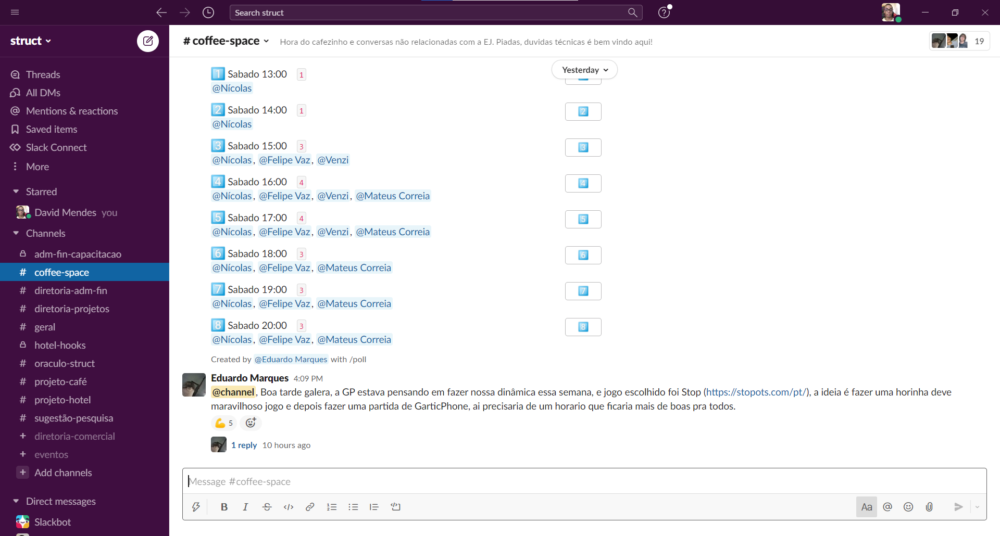
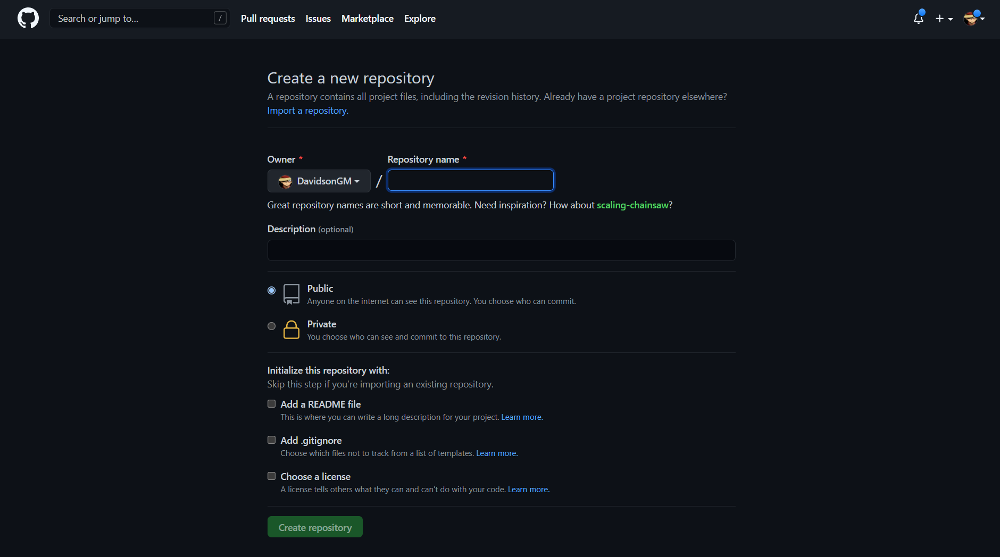

# Nossas Ferramentas

Nesta página, iremos apresentar a vocês, caros trainees, tudo que vocês precisam saber sobre as ferramentas que utilizarão ao longo de sua jornada aqui dentro da Struct.

## Discord

Aposto que a grande maioria já conheça o discord, basicamente é uma plataforma de comunicação via texto e/ou áudio e será a nossa principal plataforma para realizar reuniões, aulas ao vivo, tirar dúvidas e até para codarmos juntos!

### Por quê o discord?

Bom, com a chegada da pandemia, precisávamos nos adaptar, passando a fazer nossas reuniões e encontros todos virtualmente. Para tal fim, após algum tempo, passamos a utilizar o discord, principalmente por ser gratuito e de fácil acesso para todos, além de que boa parte dos nossos membros já eram familiarizados com a plataforma

### Como utilizar

Para utilizar o discord, basta criar uma conta no [site da plataforma](https://discord.com/) (caso ainda não tenha) e baixar o aplicativo (ou usar a versão do navegador mesmo, caso se sinta mais confortável). Em seguida, você deve receber um link para entrar no servidor da Struct no discord e sua tela será algo asssim: 


Para entrar em um canal basta clicar nele com o botão esquerdo do mouse. A maioria dos nomes estão bem autoexplicativos, mas vou passar explicando alguns mais a fundo:

- Qualquer coisa que não tenha ficado claro ou você não esteja conseguindo fazer, pode mandar no canal de dúvidas;
- Use os canais de coding quando estiver programando. Mesmo se não estiver com dificuldade, ficar no canal com alguém muitas vezes facilita o desenvolvimento (às vezes alguém na call sabe a resposta para o que você está tentando fazer e isso economiza um pouco do tempo que você gastaria pesquisando);
- O canal de pedir músicas é exclusivamente para invocar o bot de música (use `-p *nome da música*` para adicionar uma música à fila);
- Basicamente todo código que você quiser mandar ou link de alguma coisa útil pode mandar no links e códigos


Para mandar código no discord, insira entre 3 acentos graves (vulgo crase) que ele reconhecerá que é código e vai enviar de forma mais bonitinha:

```` 
```
code = "Código exemplo"
```
````


## Slack

O Slack é um aplicativo de mensagens para empresas que conecta as pessoas às informações que elas precisam. Aqui na Struct, é a nossa principal ferramenta de comunicação, então **extremamente importante** não deixar de instalar o app e ativar as notificações para não perder nenhuma informação mais importante.

### Mas por quê usar slack?

O slack é ótimo para mantermos mais organizadas todas as mensagens que estão relacionadas às tarefas da empresa, destrinchando-as em diversos canais. Desta forma evitamos que algumas mensagens importantes se percam ao longo do tempo e sabemos exatamente onde procurar cada mensagem.

### Usando o slack

Inicialmente, será necessário [criar uma conta](https://app.slack.com/ssb/get-started?ssb_vid=.e0xa6ly5iuia7euzkvar9s9ty&ssb_instance_id=dfc3cfac-fa9b-58d4-a24c-3daf75e1b4f5&v=4.18.0#/create), em seguida recomendo que [instale o aplicativo](https://slack.com/intl/pt-br/downloads/windows). Após ser convidado a entrar no workspace da Struct, abra seu aplicativo e verá essa tela:


Clique no botão verde central e você será redirecionado para uma página solicitando seu login. Após efetuar seu login, o seu workspace deve ser aberto automaticamente, caso não seja, insira o workspace da struct (struct-ej).

Já dentro do workspace, sua tela deveria ser algo assim:



Nele, provavelmente você estará em 3 canais: o canal geral, em que é falado sobre conteúdos que abrangem a empresa inteira; o canal do trainee do seu semestre, que abrange tudo relacionado ao processo trainee; e o coffee-space, que é o canal aberto na imagem acima, em que você é livre falar sobre qualquer coisa, seja reclamar de professor da UnB, ou falar alguma coisa legal que aconteceu com você ou até mesmo pedir ajuda pro povo em alguma matéria que tá muito complicada.

## Linux

Linux é um sistema operacional (assim como o windows) de código aberto que é altamente recomendado para programar pois facilita bastante o desenvolvimento. Mas como fazer pra conseguir usar esse tal de linux? Vou ter que abrir mão do meu windows para conseguir usá-lo? Na verdade, existe uma técnica chamada "dual boot", que consiste em ter 2 sistemas operacionais diferentes no mesmo computador, em que você selecionar qual utilizar na hora de ligá-lo. Confira esse [tutorial](./guias-utilizados.md#dual-boot) para saber mais detalhes de como instalar o linux em seu computador.

## GitHub

O github é uma plataforma que permite o armazenamento repositórios [git](../../execucao/git/README.md) online, o que permite guardar código e facilita o desenvolvimento de um projeto em equipe.

### Por quê o Github?

Durante o processo trainee, utilizaremos o github principalmente para facilitar o envio e correção das atividades que exigirem código, além de facilitar demais o desenvolvimento em equipe nos trabalhos em grupo.

### Usando o GitHub

Sabendo o [básico](../../execucao/git/conceitos-basicos.md) de git, utilizar o github é bem tranquilo, inicialmente precisamos [criar uma conta](https://github.com/signup?ref_cta=Sign+up&ref_loc=header+logged+out&ref_page=%2F&source=header-home), em seguida [criamos um novo repositório](https://github.com/new) e estaremos nessa tela:



Aqui escolhemos um nome para o repositório, escolhemos se vai ser público ou privado e já podemos clicar em criar repositório. Com isso seu repositório remoto já estará criado, agora para passar um repositório local para o github, basta rodar os comandos no terminal:

```
git remote add origin https://github.com/DavidsonGM/repo-example.git
git branch -M main
git push -u origin main
```
